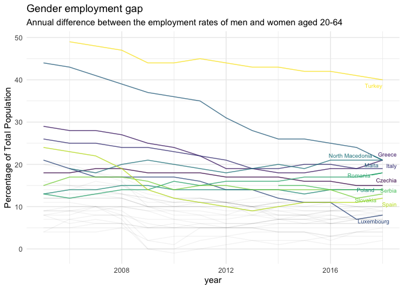
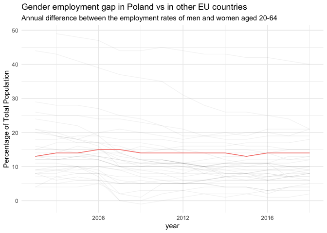
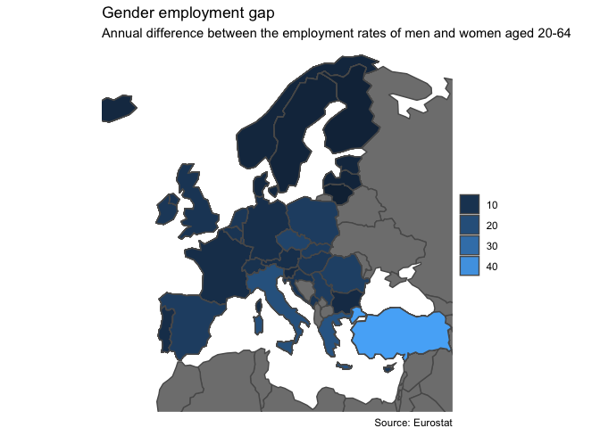
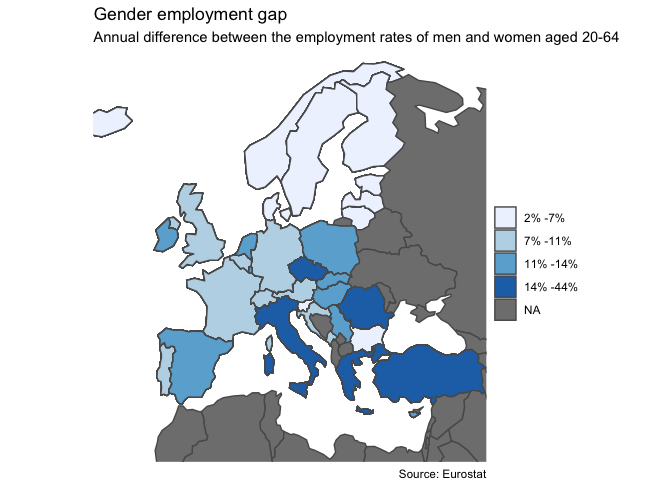
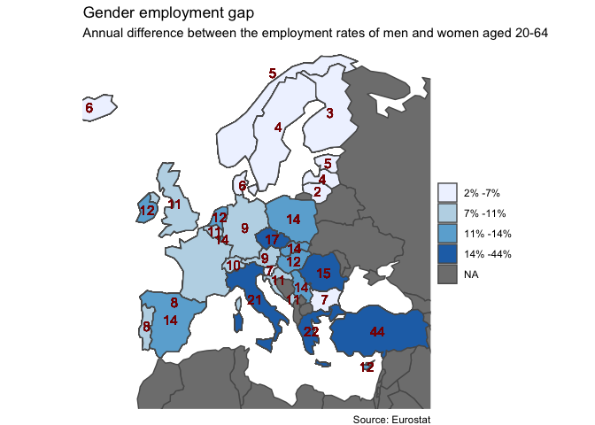
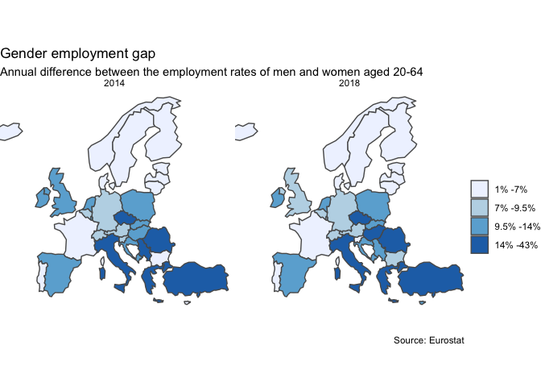
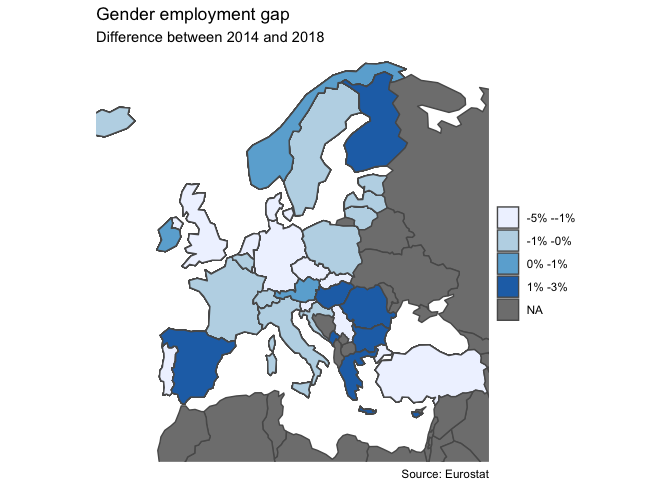
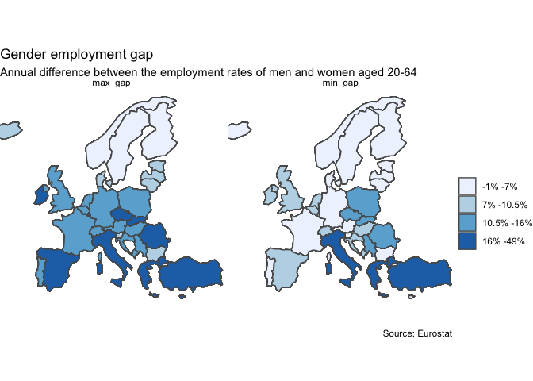

Project\_on \_Cartography\_1
================

### Opening necessary in the project libraries

# Importing Data

``` r
## Importing data from excel

structure <- read_excel("Data/TESEM0601573030089446.xlsx",
      sheet = "Structure", skip = 1)

data <- read_excel("Data/TESEM0601573030089446.xlsx",
      sheet = "Sheet 1", skip = 9) %>%
      clean_names()

## Transforming and cleaning data

years <- 2005:2018

cleaned_data <- data %>%
      pivot_longer(starts_with("x"), names_to = "Year", values_to = "gender_gap") %>%
      mutate(Year = as.numeric(str_remove(Year, "x"))) %>%
      filter(Year %in% years) %>%
      rename(country = "time") %>%
      filter(country != "France") %>%
      filter(country != "geo (Labels)" & country != "European Union - 28 countries" 
             & country != "Euro area (19 countries)" & country != "Euro area (18 countries)") %>%
      mutate(
            country = if_else(
              country == "Germany (until 1990 former territory of the FRG)", "Germany", country),
            country = if_else(
              country == "France (metropolitan)", "France", country))
```

# Question 1

  - Reshaping the dataset in order to plot the time series for the
    various countries.
  - Highlighting only the countries that have a higher employment gap.
  - Annotating the line chart so that it is possible to understand each
    line, which country it represents.
  - Removing the legend as it takes a lot of space on the chart.
  - Using an appropriate colour scale to differentiate between
    countries.

<!-- end list -->

``` r
## Changing data types and removing NAs

cleaned_data <- cleaned_data %>%
      mutate(
            Year = as.integer(Year),
            gender_gap = as.integer(gender_gap)) %>%
      filter(!is.na(gender_gap) | gender_gap != "") %>%
      filter(!is.na(Year) | Year != "") %>%
      filter(!is.na(country) | country != "")

## Selecting countries with higher employment gap.

top_countries_gap_o <- cleaned_data %>%
      group_by(country) %>%
      summarise(mean_gap = mean(gender_gap)) %>%
      arrange(desc(mean_gap)) %>%
      head(12) %>%
      pull(country)

top_countries <- cleaned_data %>%
      mutate(highlight = if_else(country %in% top_countries_gap_o, 1, 0)) %>%
      filter(highlight == 1)

## Preparing labels for plot

labels_new <- top_countries %>%
      filter(Year == max(Year))

## Plotting the chart

ggplot() +
      geom_line(data = cleaned_data, 
                mapping = aes(x = Year, y = gender_gap, group = country), alpha = 0.05) +
      geom_line(data = top_countries, 
                mapping = aes(x = Year, y = gender_gap, colour = country), alpha = 0.8) +
      geom_text_repel(data = labels_new, 
                mapping = aes(y = gender_gap, x = Year, color = country, label = country), 
                size =2.5) +
      theme_minimal() +
      scale_color_viridis_d() +
      labs(
            title = "Gender employment gap",
            subtitle = "Annual difference between the employment rates of men and women aged 20-64",
            x = "year",
            y = "Percentage of Total Population") +
      theme(legend.position = "none")
```

<!-- -->

# Question 2

  - Highlighting only one selected country in the previous chart.

<!-- end list -->

``` r
top_country <- cleaned_data %>%
      filter(country == "Poland")

ggplot() +
      geom_line(data = cleaned_data, 
                mapping = aes(x = Year, y = gender_gap, group = country), alpha = 0.05) +
      geom_line(data = top_country, 
                mapping = aes(x = Year, y = gender_gap, colour = "red")) +
      theme_minimal() +
      labs(
            title = "Gender employment gap in Poland vs in other EU countries",
            subtitle = "Annual difference between the employment rates of men and women aged 20-64",
            x = "year",
            y = "Percentage of Total Population") +
      theme(legend.position = "none")
```

<!-- -->

# Question 3

  - Ploting obtained data on a map.
  - Selecting only Europe from the map.

<!-- end list -->

``` r
## Importing maps

raw_world <- st_read("Data/naturalearth/ne_110m_admin_0_countries.shp") %>%
      clean_names()
```

    ## Reading layer `ne_110m_admin_0_countries' from data source `/Users/magda/Documents/EPFL/Final_Project_1/Final_Project_1/Report_3/Data/naturalearth/ne_110m_admin_0_countries.shp' using driver `ESRI Shapefile'
    ## Simple feature collection with 177 features and 94 fields
    ## Geometry type: MULTIPOLYGON
    ## Dimension:     XY
    ## Bounding box:  xmin: -180 ymin: -90 xmax: 180 ymax: 83.64513
    ## CRS:           4326

``` r
raw_world <- raw_world %>%
      left_join(cleaned_data, c("name" = "country"))

world <- raw_world %>%
      group_by(name) %>%
      mutate(gender_gap = as.integer(mean(gender_gap))) %>%
      ungroup()

## Creating map with my data

ggplot() +
      geom_sf(
            data = world,
            mapping = aes(fill = gender_gap)) +
      theme_void() +
      coord_sf(xlim = c(-20, 45), ylim = c(30, 73), expand = FALSE) +
      labs(
            title = "Gender employment gap",
            subtitle = "Annual difference between the employment rates of men and women aged 20-64",
            x = "year",
            y = "Percentage of Total Population",
            caption = "Source: Eurostat") +
      guides(fill = guide_legend(title = ""))
```

<!-- -->

# Question 4

  - Transforming map in a choropleth.
  - Dividing the continuous variable into categories.
  - Distributing colours evenly across the map.
  - Using a proper colour scale.

<!-- end list -->

``` r
## Calculating Quantiles

quantile_vec <- cleaned_data %>%
      group_by(country) %>%
      mutate(gender_gap = as.integer(mean(gender_gap))) %>%
      pull(gender_gap) %>%
      quantile(probs = c(0, 0.25, 0.5, 0.75, 1), na.rm = TRUE)


## Dividing the map

world <- world %>%
      mutate(quantiles = cut(gender_gap, breaks = quantile_vec, include.lowest = TRUE))

## Preparing labels

labels <- tibble(
      lab1 = quantile_vec,
      lab2 = c(quantile_vec[2:length(quantile_vec)], NA)) %>%
      slice(1:n() - 1) %>% # We remove the last row, since it has no meaning
      mutate_all(paste0, "%") %>% # We add the dollar sign after the digits
      mutate(labs = paste(lab1, lab2, sep = " -"))

world <- world %>%
      mutate(quantiles = cut(gender_gap,
            breaks = quantile_vec,
            labels = labels$labs,
            include.lowest = TRUE ))

## Plotting a map

ggplot() +
      geom_sf(
            data = world,
            mapping = aes(fill = quantiles)) +
      coord_sf(xlim = c(-20, 45), ylim = c(30, 73), expand = FALSE) +
      labs(
            title = "Gender employment gap",
            subtitle = "Annual difference between the employment rates of men and women aged 20-64",
            caption = "Source: Eurostat") +
      theme_void() +
      guides(fill = guide_legend(title = "")) +
      scale_fill_brewer(na.value = "grey50")
```

<!-- -->

I obtained slightly different values than on the presented in the
instruction map, as I removed NA values at the begining.

# Question 5

  - Adding the annotation on top of each country to show the gender
    employment gap.

<!-- end list -->

``` r
## Finding Coorodinates for country centers

world_centers <- cbind(world, st_coordinates(st_centroid(world)))

## Creating a plot

ggplot() +
      geom_sf(
            data = world,
            aes(fill = quantiles)) +
      geom_text(data = world_centers, aes(X, Y, label = gender_gap), size = 4, colour = "darkred") +
      coord_sf(xlim = c(-20, 45), ylim = c(30, 73), expand = FALSE) +
      labs(
            title = "Gender employment gap",
            subtitle = "Annual difference between the employment rates of men and women aged 20-64",
            caption = "Source: Eurostat") +
      theme_void() +
      guides(fill = guide_legend(title = "")) +
      scale_fill_brewer(na.value = "grey50")
```

<!-- -->

# Question 6

  - Checking how did the gender employment gap changed over the years in
    the different countries.
  - Using a map to show a timeseries (min.2 years).

<!-- end list -->

``` r
## Filtering only two years

filtered_world <- raw_world %>%
      filter(Year == 2018 | Year == 2014) %>%
      mutate(gender_gap = as.integer(gender_gap))

## Calculating Quantiles

quantile_vec_2014_2018 <- cleaned_data %>%
      filter(Year == 2018 | Year == 2014) %>%
      group_by(country,Year) %>%
      mutate(gender_gap = as.integer(mean(gender_gap))) %>%
      pull(gender_gap) %>%
      quantile(probs = c(0, 0.25, 0.5, 0.75, 1), na.rm = TRUE)


## Dividing the map

filtered_world <- filtered_world %>%
      mutate(quantiles = cut(gender_gap, breaks = quantile_vec_2014_2018, include.lowest = TRUE))

## Preparing labels

labels <- tibble(
      lab1 = quantile_vec_2014_2018,
      lab2 = c(quantile_vec_2014_2018[2:length(quantile_vec_2014_2018)], NA)) %>%
      slice(1:n() - 1) %>% # We remove the last row, since it has no meaning
      mutate_all(paste0, "%") %>% # We add the dollar sign after the digits
      mutate(labs = paste(lab1, lab2, sep = " -"))

filtered_world <- filtered_world %>%
      mutate(quantiles = cut(gender_gap,
            breaks = quantile_vec_2014_2018,
            labels = labels$labs,
            include.lowest = TRUE ))

##  Creating a plot

ggplot() +
      geom_sf(
            data = filtered_world,
            aes(fill = quantiles)) +
      coord_sf(xlim = c(-20, 45), ylim = c(30, 73), expand = FALSE) +
      labs(
            title = "Gender employment gap",
            subtitle = "Annual difference between the employment rates of men and women aged 20-64",
            caption = "Source: Eurostat") +
      theme_void() +
      guides(fill = guide_legend(title = "")) +
      facet_wrap(vars(Year)) +
      scale_fill_brewer(na.value = "grey50")
```

<!-- -->

# Question 7

  - Highlighting the difference between years for the different
    countries.
  - Making a map with the differences between different years, for each
    country.

<!-- end list -->

``` r
## Calculating Quantiles

quantile_vec_dif <- cleaned_data %>%
      filter(Year == 2018 | Year == 2014) %>%
      pivot_wider(names_from = "Year",
                  values_from = "gender_gap") %>%
      mutate(year2018 = as.integer(`2018`),
             year2014 = as.integer(`2014`),
             gender_gap_dif = year2018 - year2014) %>%
      pull(gender_gap_dif) %>%
      quantile(probs = c(0, 0.25, 0.5, 0.75, 1), na.rm = TRUE)

## Calculating difference

cleaned_data_dif <- cleaned_data %>%
      filter(Year == 2018 | Year == 2014) %>%
      pivot_wider(names_from = "Year",
            values_from = "gender_gap") %>%
      mutate(year2018 = as.integer(`2018`),
             year2014 = as.integer(`2014`),
             gender_gap_dif = year2018 - year2014)

world <- world %>%
      left_join(cleaned_data_dif, c("name" = "country"))

## Dividing the map

world <- world %>%
      mutate(quantiles_dif = cut(gender_gap_dif, breaks = quantile_vec_dif, include.lowest = TRUE))

## Preparing Labels

labels <- tibble(
      lab1 = quantile_vec_dif,
      lab2 = c(quantile_vec_dif[2:length(quantile_vec_dif)], NA)) %>%
      slice(1:n() - 1) %>% # We remove the last row, since it has no meaning
      mutate_all(paste0, "%") %>% # We add the dollar sign after the digits
      mutate(labs = paste(lab1, lab2, sep = " -"))

world <- world %>%
      mutate(quantiles_dif = cut(gender_gap_dif,
            breaks = quantile_vec_dif,
            labels = labels$labs,
            include.lowest = TRUE))

## Plotting a chart

ggplot() +
      geom_sf(
            data = world,
            mapping = aes(fill = quantiles_dif)) +
      coord_sf(xlim = c(-20, 45), ylim = c(30, 73), expand = FALSE) +
      labs(
            title = "Gender employment gap",
            subtitle = "Difference between 2014 and 2018",
            caption = "Source: Eurostat") +
      theme_void() +
      guides(fill = guide_legend(title = "")) +
      scale_fill_brewer(na.value = "grey50")
```

<!-- -->

# Question 8

  - Transforming the projection to a different one and ploting the map
    again.
  - Compering maximum and minimum employment gaps over the years.
  - Using an appropriate projection for this type of map.

<!-- end list -->

``` r
## Preparing data

cleaned_data_max_min <- cleaned_data %>%
      group_by(country) %>%
      summarise(
            max_gap = max(gender_gap),
            min_gap = min(gender_gap)) %>%
      pivot_longer(
            cols = c("max_gap", "min_gap"),
            names_to = "gap_type",
            values_to = "gap_max_min")

## Combining tables

world <- world %>%
      left_join(cleaned_data_max_min, c("name" = "country"))

world <- world %>%
      filter(!is.na(gap_type))

quantile_vec_max_min <- cleaned_data_max_min %>%
      pull(gap_max_min) %>%
      quantile(probs = c(0, 0.25, 0.5, 0.75, 1), na.rm = TRUE)

## Dividing the map

world <- world %>%
      mutate(quantiles_max_min = cut(gap_max_min, breaks = quantile_vec_max_min, include.lowest = TRUE))

## Preparing Labels

labels <- tibble(
      lab1 = quantile_vec_max_min,
      lab2 = c(quantile_vec_max_min[2:length(quantile_vec_max_min)], NA)) %>%
      slice(1:n() - 1) %>% # We remove the last row, since it has no meaning
      mutate_all(paste0, "%") %>% # We add the dollar sign after the digits
      mutate(labs = paste(lab1, lab2, sep = " -"))

world <- world %>%
      mutate(quantiles_max_min = cut(gap_max_min,
            breaks = quantile_vec_max_min,
            labels = labels$labs,
            include.lowest = TRUE))

## Creating a map

ggplot() +
      geom_sf(
            data = world,
            aes(fill = quantiles_max_min)) +
      coord_sf(xlim = c(-20, 45), ylim = c(30, 73), expand = FALSE) +
      labs(
            title = "Gender employment gap",
            subtitle = "Annual difference between the employment rates of men and women aged 20-64",
            caption = "Source: Eurostat") +
      theme_void() +
      guides(fill = guide_legend(title = "")) +
      facet_wrap(vars(gap_type)) +
      scale_fill_brewer(na.value = "grey50")
```

<!-- -->

# Question 9

Answering below questions:

  - Which are the countries with the highest gender employment gap rate
    in Europe (top 5)?
  - Which is the countries with the lowest gender employment gap in
    Europe (top 5)?
  - For which countries the employment gap decreased the most in
    percentage points over the years?

<!-- end list -->

``` r
## Calculating the highest gender employment gap rate in Europe

biggest_gap <- cleaned_data %>%
  filter(Year == max(Year)) %>%
  arrange(desc(gender_gap)) %>%
  head(5) %>%
  pull(country)

## Calculating the lowest gender employment gap in Europe

smallest_gap <- cleaned_data %>%
  filter(Year == max(Year)) %>%
  arrange(gender_gap) %>%
  head(5) %>%
  pull(country)
  
## Calculating the biggest difference in employment gap

biggest_dif_gap <- cleaned_data %>%
  group_by(country) %>%
   summarise(gap_difference = max(gender_gap) - min(gender_gap)) %>%
  arrange(desc(gap_difference)) %>%
  head(5) %>%
  pull(country)
```

The highest gender employment gap rate in Europe have following
countries: Turkey, Greece, Malta, North Macedonia, Italy.  
The lowest gender employment gap rate in Europe have following
countries: Lithuania, Finland, Latvia, Sweden, Norway.  
The gender employment gap rate in Europe was decreased the most in the
following countries: Malta, Spain, Cyprus, Luxembourg, Ireland.
