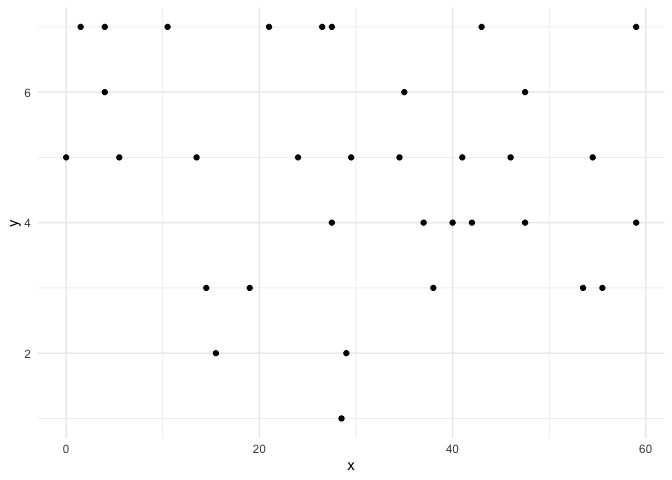
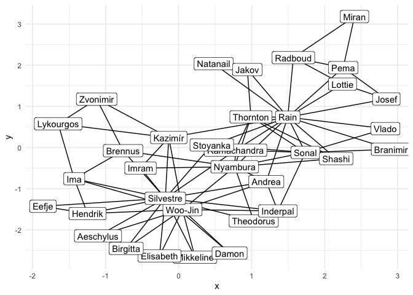
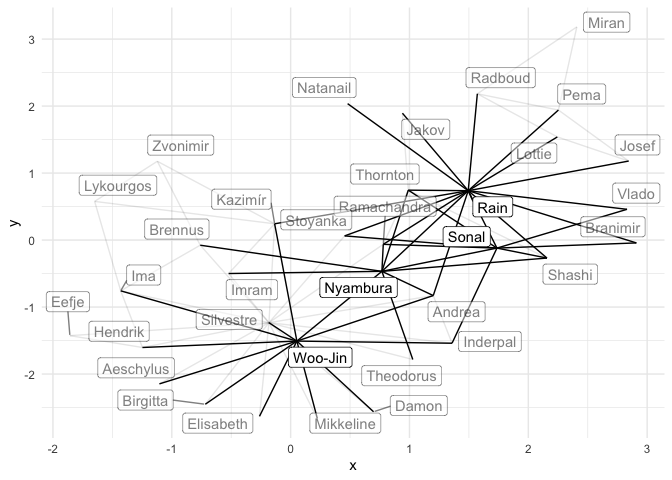
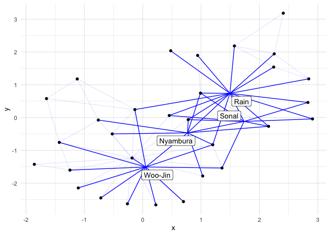
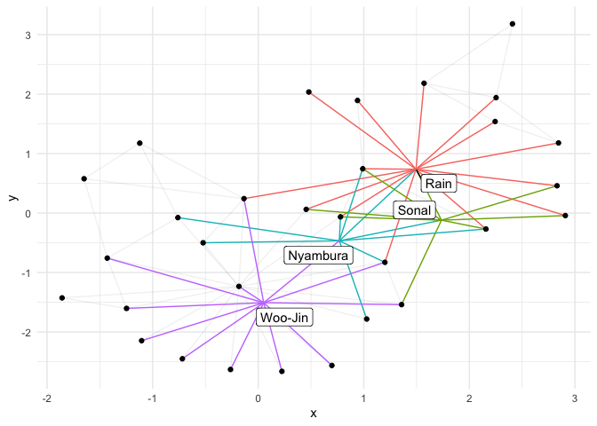
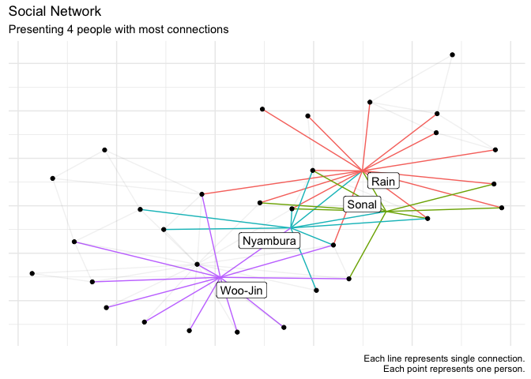

Project\_on\_Data\_Networks\_1
================

### Opening necessary in the project libraries

# Importing Data

  - Cleaning names

<!-- end list -->

``` r
edges_tibble <- read_excel("Data/data.xlsx", sheet = "edges") %>%
          janitor::clean_names() 


nodes_tibble <- read_excel("Data/data.xlsx", sheet = "nodes") %>%
          janitor::clean_names() 
```

# Part 1 - A first impression of the network

  - Converting data
  - Creating an initial plot containing the nodes and edges

<!-- end list -->

``` r
tidy_classroom <- tbl_graph(
      nodes = nodes_tibble,
      edges = edges_tibble)

## Creating a graph

ggraph(tidy_classroom) +
      geom_node_point() +
      theme_minimal()
```

<!-- -->

# Part 2 - Personalise the network

  - Ploting the same network, but now each node has a relevant first
    name.

<!-- end list -->

``` r
## Preparing first names

both_names_split <- tidy_classroom %>%
      activate(nodes) %>%
      mutate(first_name = str_sub(name, 1, str_locate(name, " ")[,2]-1))

## Creating a plot

both_names_split %>%
      ggraph(layout = "igraph", algorithm = "kk") +
      geom_edge_link() +
      geom_node_label(mapping = aes(label = first_name)) +
      theme_minimal()
```

<!-- -->

# Part 3 - Well-connected people

  - Finding out how many edges each indvidual has
  - Creating a visualization of the complete network
  - Highlighting 4 individuals with the most connections

<!-- end list -->

``` r
## Selecting people with the most number of connections

names_to <- both_names_split %>%
      activate(edges) %>%
      as_tibble() %>%
      group_by(to) %>%
      summarize(connection_to = n())

names_from <- both_names_split %>%
      activate(edges) %>%
      as_tibble() %>%
      group_by(from) %>%
      summarize(connection_from = n())

most_connections <- names_to %>%
      left_join(names_from, by = c("to" = "from")) %>%
      dplyr::mutate(
            connection_from = connection_from %>%
                  replace_na(0),
            connection_to = connection_to %>%
                  replace_na(0)) %>%
      mutate(id = to,
            connections = connection_to + connection_from) %>%
      arrange(desc(connections)) %>%
      mutate(order_names = dense_rank(desc(connections))) %>%
      filter(order_names <= 4) %>%
      dplyr::select(id, connections) %>%
      head(4)

## Complete table with names, id, connections of top people

id_name_connection <- most_connections %>%
      left_join(nodes_tibble, by = "id")

## Saving Top Names

top_names <- id_name_connection %>%
      pull(name)

## Saving Top IDs

top_ids <- id_name_connection %>%
      pull(id)

## Saving number of connections

top_connections <- id_name_connection %>%
      pull(connections)

## Higlighting the people with most connections

both_names_split <-
      both_names_split %>%
      activate(nodes) %>%
      mutate(highlight = if_else(id %in% top_ids, true = 1, false = 0))

## Highlighting nodes

both_names_split <- both_names_split %>%
      activate(edges) %>%
      mutate(highlight_edges = if_else(from %in% top_ids | to %in% top_ids, 1, 0))

## Creating a plot

both_names_split %>%
      ggraph(layout = "igraph", algorithm = "kk") +
      geom_edge_link(aes(alpha = highlight_edges)) +
      geom_node_label(mapping = aes(label = first_name, alpha = highlight), repel = TRUE) +
      theme_minimal() +
      scale_alpha(range = c(0.5, 1), guide = FALSE) +
      scale_edge_alpha(guide = FALSE)
```

<!-- -->

Most connections has Rain Lemmi, Woo-Jin Tosetti, Nyambura Fischer,
Sonal Matić with respective number of 16, 12, 10, 9 connections and they
IDs are 1, 33, 3, 2.

# Part 4 - Well-connected people (2)

  - Showing a name for the four individuals with the four most
    connections.
  - Adding a symbol for the rest of individuals.

<!-- end list -->

``` r
## Highlighting dots for people not from TOP 4

both_names_split <-
      both_names_split %>%
      activate(nodes) %>%
      mutate(highlight_points = if_else(id %in% top_ids, true = 0, false = 1))


## Creating plot

both_names_split %>%
      ggraph(layout = "igraph", algorithm = "kk") +
      geom_edge_link(aes(alpha = highlight_edges), colour = "blue") +
      geom_node_point(aes(alpha = highlight_points)) +
      geom_node_label(mapping = aes(label = first_name, alpha = highlight), repel = TRUE) +
      theme_minimal() +
      scale_alpha(range = c(0, 1), guide = FALSE) +
      scale_edge_alpha(guide = FALSE)
```

<!-- -->

# Part 5 - Colour the graph

  - Colouring the edges according to which central figure they are
    connected to.
  - Leaving edges not related to any central figures gray.
  - Letting the from column determine which colour they should get.

<!-- end list -->

``` r
## Prepring data to higlight edges

both_names_split <- both_names_split %>%
  activate(edges) %>%
  mutate (new_group = as.factor(case_when(
    to %in% top_ids & from %in% top_ids ~ from,
     to %in% top_ids | from %in% !top_ids ~ to,
     to  %in% !top_ids | from %in% top_ids ~ from)))

## Creating plot

  both_names_split %>%
  ggraph(layout = "igraph", algorithm = "kk") +
  geom_edge_link(aes(alpha = highlight_edges, colour=new_group)) +
  geom_node_point(aes(alpha = highlight_points)) +
  geom_node_label(mapping = aes(label = first_name, alpha=highlight),repel = TRUE) +
  theme_minimal () +
  scale_alpha(range = c(0, 1), guide = FALSE) +
  scale_edge_alpha(guide = FALSE) +
  theme(legend.position = "none")
```

<!-- -->

# Part 6 - Polishing up

  - Polishing up the chart
  - Removing unnecessary axis
  - Adding informative captions

<!-- end list -->

``` r
  both_names_split %>%
  ggraph(layout = "igraph", algorithm = "kk") +
  geom_edge_link(aes(alpha = highlight_edges, colour=new_group)) +
  geom_node_point(aes(alpha = highlight_points)) +
  geom_node_label(mapping = aes(label = first_name, alpha=highlight),repel = TRUE) +
  theme_minimal () +
  scale_alpha(range = c(0, 1), guide = FALSE) +
  scale_edge_alpha(guide = FALSE) +
  theme(legend.position = "none",
        axis.title.x = element_blank(),
        axis.title.y = element_blank(),
        axis.text.y = element_blank(),
        axis.text.x = element_blank()) +
  labs(
        title = "Social Network",
        subtitle = "Presenting 4 people with most connections",
        caption = "Each line represents single connection.
                   Each point represents one person.")
```

<!-- -->
