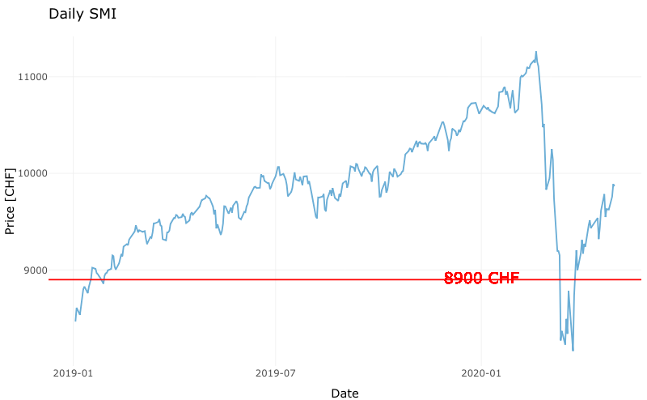

### Opening necessary in the project libraries

```{r message=FALSE, warning=FALSE, include=FALSE}

library(stringr)
library(janitor)
library(lubridate)
library(tidyverse)
library(dplyr)
library(tibble)
library(ggplot2)
library(ggthemes)
library(hrbrthemes)
library(readr)
library(readxl) # to read excel files
library(openxlsx) # to export to excel
library(DBI) #to work with databases
library(RSQLite) # for SQL Lite
library(RPostgres) # for POstSQL
library(gt) #piza dataset 
library(janitor)
library(ggmosaic) # for mozaic maps
library(forcats)  # to work with categorical variables
library(extrafont) # to export files with special fonts
library(RColorBrewer)
library(plotly)
library(visdat)
library(OpenStreetMap)
library(ggmap)
library(sf)
library(mapview)
library(mapedit)
library (cartogram)
library(gramr)
library(remedy)
library(tsibble)
library(rvest)
library(httr)
library(remedy)
library(knitr)
```

# 0. Importing Data

+ Cleaning names
+ Changing data types 

```{r echo=TRUE, message=FALSE, warning=FALSE}

swiss_market <- read_csv("Data/data_smi.csv") %>%
                janitor::clean_names() %>%
                mutate(date = dmy(date))
```

# 1. Creating Lineplot 

+ Plotting a lineplot using the whole daily SMI values.
+ Comment: Data starts from the 5th of January 2015.

```{r echo=TRUE, message=FALSE, warning=FALSE}

  swiss_market %>%
  ggplot(mapping = aes(x = date, y = price)) + 
  geom_line(color = "#6baed6") +
    labs(title = "Daily SMI",
       subtitle = "Using whole daily SMI values",
       x = "Date",
       y = "Price [CHF]") +
  theme_minimal()

```

# 2. Creating Filtered Lineplot

+ Plotting a lineplot using daily SMI values since January 1, 2019.

```{r echo=TRUE, message=FALSE, warning=FALSE}

swiss_market %>%
  filter(date >= dmy('01-01-2019')) %>%
  ggplot(mapping = aes(x = date, y = price)) + 
  geom_line(color = "#6baed6") +
      labs(title = "Daily SMI",
       subtitle = "SMI Values after January 2019",
       x = "Date",
       y = "Price [CHF]") +
  theme_minimal()

```

# 3. Adding Horizontal Line

+ Drawing a red horizontal line on the previous graph corresponding to CHF 8900.
+ Adding label with marked value.

```{r echo=TRUE, message=FALSE, warning=FALSE}

plot_part3 <- swiss_market %>%
  filter(date >= dmy('01-01-2019')) %>%
  ggplot(mapping = aes(x = date, y = price)) + 
  geom_line(color = "#6baed6") +
  geom_hline(yintercept = 8900, colour='red')+
  geom_text(aes(dmy('01-01-2020'),8900,label = "8900 CHF", vjust = -2), color = "red", size=5)+
      labs(title = "Daily SMI",
       subtitle = "SMI Values after January 2019",
       x = "Date",
       y = "Price [CHF]") +
  theme_minimal()

```

# 4. Finding values on the plot

+ Finding the date in 2019 for which the SMI value was below CHF 8900 for the last time of the year. 
+ Finding the date in 2020 for which the SMI value was below CHF 8900 for the first time of the year
+ Finding these values using plotly package.

```{r echo=TRUE, message=FALSE, warning=FALSE}

## ggplotly(plot_part3)

```



From the obtained visualization we can read that:  
- on the 28th of January,2018 was the last time in 2019 when the SMI was below CHF 8900,  
- on the 12th of March, 2002 was the first time in 2020 when the SMI was below CHF8900.

# 5. Finding values in the data

+ Finding the two dates obtained in Part 4 using R code. 

```{r echo=TRUE, message=FALSE, warning=FALSE}

last_time <- swiss_market %>%
      filter(year(date) == "2019" & price < 8900) %>%
      arrange(desc(date)) %>%
      head(1) %>%
      pull(date)

first_time <- swiss_market %>%
      filter(year(date) == "2020" & price < 8900) %>%
      arrange(date) %>%
      head(1) %>%
      pull(date)
  
```

The SMI value was below CHF 8900 for the last time in the 2019 on the `r last_time`.  
In 2020 SMI value was below CHF 8900 for the first time on the `r first_time`.  

# 6. Calculating dates difference

+ Calculating how many days elapsed between the two dates obtained in Part 5.
+ Using functions of the {lubridate} package.

```{r echo=TRUE, message=FALSE, warning=FALSE}

day_difference <- as.double(difftime(ymd(first_time),
                ymd(last_time),
                units = "days"))

```

Between two days in part 5 elapsed `r day_difference` days.

# 7. Calculating Weekly Avarage Prices

+ Computing weekly mean values.
+ Storing them in a tibble named data_smi_wkly.
+ Using the yearweek() function of the {tsibble} package.
+ Producing a timeplot showing SMI weekly mean values since January 2019, after building the data_smi_wkly data set.
+ Using geom_point() instead of geom_line().
+ Display the points in blue colour.

```{r echo=TRUE, message=FALSE, warning=FALSE}

## Preparing data

data_smi_wkly <- swiss_market %>%
      mutate(week = yearweek(date)) %>%
      group_by(week) %>%
      summarise(week_avg = mean(price))

## Creating a chart

data_smi_wkly %>%
      filter(year(week) >= "2019") %>%
      ggplot(aes(x = week, y = week_avg)) +
      geom_point(color = "blue") +
       labs(title = "Weekly SMI Values",
       x = "Week",
       y = "Price [CHF]") +
      theme_minimal()
  
```

# 8. Compering weekly vs daily SMI values

+ Producing a timeplot showing daily SMI values since January 2019 versus week values.
+ Using  tsibble::yearweek() function to obtain week values. 
+ Using geom_point() to get 5 dots vertically aligned per week value.


```{r echo=TRUE, message=FALSE, warning=FALSE}

  ggplot()+
  geom_point(data = data_smi_wkly %>%
                filter(year(week) >= '2019'),
           mapping= aes(x=week,y=week_avg),
           color ='blue') +
geom_point( data = swiss_market %>%
              filter(date >= dmy('01-01-2019')),
            mapping = aes(x = date, y = price),
            color = "#6baed6") +
   labs(title = "Weekly vs Daily SMI Values",
       x = "Week",
       y = "Price [CHF]") +
  theme_minimal()

```

# 9. Presenting monthly SMI values

+ Computing monthly mean values and storing them in a tibble named data_smi_mthly. 
+ Using the yearmonth() function of the {tsibble} package.
+ Producing a timeplot showing SMI monthly mean values since January 2019. 
+ Using only geom_point(). 

```{r echo=TRUE, message=FALSE, warning=FALSE}

## Preparing data

data_smi_mthly <-  swiss_market %>%
  mutate(week = yearmonth(date))  %>%
  group_by(week) %>%
  summarise(week_avg= mean(price))

## Creating a chart.

data_smi_mthly %>%
  filter(year(week) >= '2019') %>%
  ggplot(aes(x=week,y=week_avg)) +
  geom_point (color='blue') +
     labs(title = "Monthly Average SMI Values",
       x = " Month",
       y = " Price [CHF]") +
  theme_minimal()

```

# 10. Compering monthly vs daily SMI values

+ Producing a timeplot showing daily SMI values since January 2019 versus month values.
+ Obtaining monthly values with the tsibble::yearmonth() function. 
+ Using geom_point(). 

```{r echo=TRUE, message=FALSE, warning=FALSE}

  ggplot()+
  geom_point(data = data_smi_mthly %>%
                filter(year(week) >= '2019'),
           mapping= aes(x=week,y=week_avg),
           color ='blue') +
geom_point( data = swiss_market %>%
              filter(date >= dmy('01-01-2019')),
            mapping = aes(x = date, y = price),
            color = "#6baed6") +
     labs(title = "Monthly vs Daily SMI Values",
       x = "Month",
       y = "Price [CHF]") +
  theme_minimal()

```

# 11. Presenting daily SMI values on boxplots

+ Producing boxplots of daily SMI values since January 2019 (one boxplot for each month). 
+ Using the same input data as the one used in Part 10.

```{r echo=TRUE, message=FALSE, warning=FALSE}

## Preparing data

new_data <- swiss_market %>%
  mutate( week = yearmonth(date)) %>%
  left_join(data_smi_mthly, by= c("week") ) %>%
  filter(year(week) >= '2019') %>%
  mutate(week = as.factor(week))

## Creating a plot.

ggplot() +
      geom_boxplot(
            data = new_data,
            mapping = aes(x = price, y = week), fill = "#eff3ff") +
      labs( title = "SMI Values in 2019",
            x = "Price [CHF]",
            y = "Month") +
      theme_minimal()

```

# 12. Open ended question 

+ Choosing data about crashes in aviation
+ Calculating number of crashes per year
+ Plotting the data

```{r echo=TRUE, message=FALSE, warning=FALSE}

## Importing Data

crashes <- read_csv("Data/airplane_crashes.csv") %>%
      janitor::clean_names()

## Calculating number of crashes per year

year_crashes <- crashes %>%
      filter(!is.na(date)) %>%
      mutate(
            date = mdy(date),
            year = year(date)
      ) %>%
      group_by(year) %>%
      summarise(crashes_sum = n())

## Calculating max value

year_crashes_max <- year_crashes %>%
      arrange(desc(crashes_sum)) %>%
      head(1)

max_year <- year_crashes_max %>%
      pull(year)

max_cases <- year_crashes_max %>%
      pull(crashes_sum)

## Creating a plot

ggplot() +
      geom_point(
            data = year_crashes,
            mapping = aes(x = year, y = crashes_sum), color = "#6baed6") +
      geom_point(
            data = year_crashes_max,
            mapping = aes(x = year, y = crashes_sum),
            color = "red") +
      geom_text(
            data = year_crashes_max,
            mapping = aes(x = year, y = crashes_sum, label = year, vjust = 1.5),
            color = "red") +
      theme_minimal() +
      labs(
            title = "Airplane crashes",
            subtitle = "Number of accidents from 1908 until 2019",
            caption = "Source: Data World Website",
            x = "Year",
            y = "Number of crashes")

``` 

From the obtained chart we can notice that number of airplane crashes is changing over the years.  
Until around 1950 numbers were rapidly increasing and then remain more stable.  
In the last years we can notice again that numbers are decreasing.  
The highest number of `r max_cases` airplane crashes happened in `r max_year`.

