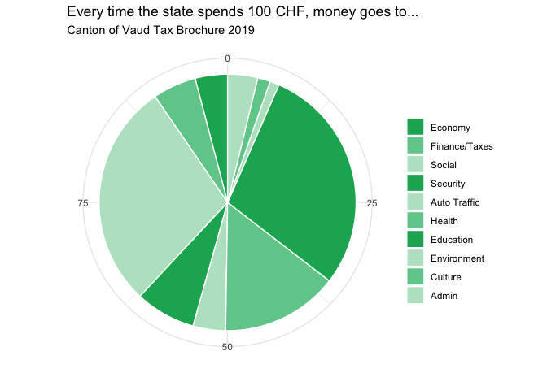
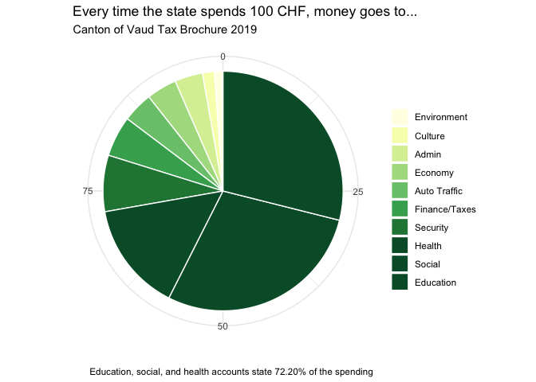
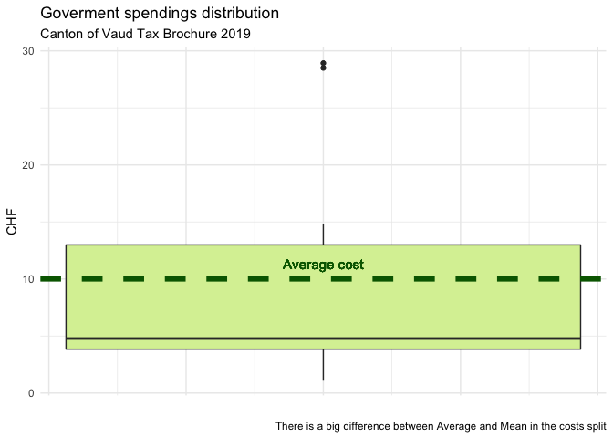
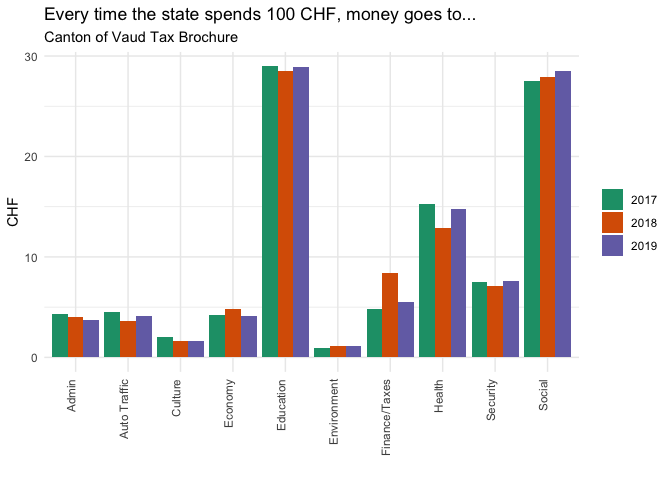

Project\_on\_Chart\_Make\_Over\_1
================

### Opening necessary in the project libraries

# Part 1

  - Creating table with data.
  - Plotting a pie chart.

<!-- end list -->

``` r
## Creating table with data

data_2019 <- tribble(
      ~expense_type, ~cost,
      "Economy", 4.08,
      "Finance/Taxes", 5.47,
      "Social", 28.50,
      "Security", 7.60,
      "Auto Traffic", 4.09,
      "Health", 14.78,
      "Education", 28.92,
      "Environment", 1.16,
      "Culture", 1.6,
      "Admin", 3.77)

## Preparing colors

my_palette <- c(
      "#0EB05F", "#6FCC99", "#B8E4C9", "#0EB05F", "#B8E4C9",
      "#6FCC99", "#0EB05F", "#B8E4C9", "#6FCC99", "#B8E4C9")

## Creating a pie chart

data_2019 %>%
      mutate(expense_type = fct_inorder(expense_type)) %>%
      ggplot(mapping = aes(x = "", y = cost, fill = expense_type)) +
      geom_col(color = "white") +
      coord_polar(theta = "y") +
      labs(
            title = "Every time the state spends 100 CHF, money goes to...",
            subtitle = "Canton of Vaud Tax Brochure 2019",
            x = "",
            y = "") +
      guides(fill = guide_legend(title = "")) +
      theme_minimal() +
      scale_fill_manual(values = my_palette)
```

<!-- -->

# Part 2

  - Starting from the code written for part 1
  - Creating another pie chart with a more readable color palette.
  - Reordering the categories in an order that is more interesting.

<!-- end list -->

``` r
## Preparing data

data_ordered <- data_2019 %>%
      arrange(cost)

## Preparing colors

my_new_palette <- c(
      "#ffffe5", "#f7fcb9", "#d9f0a3", "#addd8e", "#78c679",
      "#41ab5d", "#238443", "#005a32", "#005a32", "#005a32")

## Ploting a chart

data_ordered %>%
      mutate(expense_type = fct_inorder(expense_type)) %>%
      ggplot(mapping = aes(x = "", y = cost, fill = expense_type)) +
      geom_col(color = "white") +
      coord_polar(theta = "y") +
      labs(
            title = "Every time the state spends 100 CHF, money goes to...",
            subtitle = "Canton of Vaud Tax Brochure 2019",
            caption = "Education, social, and health accounts state 72.20% of the spending",
            x = "",
            y = "") +
      guides(fill = guide_legend(title = "")) +
      theme_minimal() +
      scale_fill_manual(values = my_new_palette)
```

<!-- -->

``` r
## Preparing inline text

top_categories <- data_2019 %>%
      arrange(desc(cost)) %>%
      head(3) %>%
      pull(expense_type)

top_part <- data_2019 %>%
      filter(expense_type %in% top_categories) %>%
      summarise(top_part = sum(cost)) %>%
      pull(top_part)
```

On the above pie chart data is ordered by the value of expenses.  
The biggest part marked together in dark green goes to Education,
Social, Health and it takes 72.2 % of the total costs.

# Part 3

  - Presenting at least two alternatives to the pie chart to represent
    the same data.
  - Creating a column chart.

<!-- end list -->

``` r
## Preparing colors

my_col_palette <- c(
      "#ffffe5", "#f7fcb9", "#d9f0a3", "#addd8e", "#78c679",
      "#41ab5d", "#238443", "#006837", "#004529", "#000000")

## Creating column chart

data_ordered %>%
      mutate(expense_type = fct_inorder(expense_type)) %>%
      ggplot(mapping = aes(x = expense_type, y = cost, fill = expense_type)) +
      geom_col(color = "white") +
      labs(
            title = "Every time the state spends 100 CHF, money goes to...",
            subtitle = "Canton of Vaud Tax Brochure 2019",
            caption = "Education, social, and health accounts state 72.20% of the spending",
            x = "",
            y = "CHF") +
      guides(fill = guide_legend(title = "")) +
      theme_minimal() +
      scale_fill_manual(values = my_col_palette) +
      theme(axis.text.x = element_blank())
```

<!-- -->

On the presented above column chart it’s easier to notice differences in
costs between different catogories.  
I think it’s also easier to match columns with categories.  
It seems like on Social and Education go most of the spendings.

``` r
## Calculating avarage cost

average_y <- data_ordered %>%
  summarise(average_cost = mean(cost)) %>%
  pull (average_cost)

## Creating box plot

data_ordered %>%
      mutate(expense_type = fct_inorder(expense_type)) %>%
      ggplot(mapping = aes(y = cost)) +
      geom_boxplot(fill="#d9f0a3" ) +
      geom_hline(yintercept = average_y, color = "darkgreen",linetype="dashed",size = 2) +
     geom_text(aes(0, average_y,label = "Average cost",vjust = -1), color = "darkgreen", size=4,) +
      labs(title = "Goverment spendings distribution",
            subtitle = "Canton of Vaud Tax Brochure 2019",
            caption = "There is a big difference between Average and Mean in the costs split",
            x = "",
            y = "CHF") +
      guides(fill = guide_legend(title = "")) +
      theme_minimal() +
    theme(axis.text.x = element_blank())
```

<!-- -->

On the above chart we can notice that there is a big difference between
mean and average of costs which means that spendings are not evenly
distributed among different categories. On the top part of this chart we
can see outliers which cause the difference between these two values.

# Part 4

  - Adding the data found in the 2017 and 2018 editions
  - Producing one or several visualisations that focus on what has
    changed/not-changed in the public spending.
  - Explaining obtained on the chart data in a short paragraph.

<!-- end list -->

``` r
## Importing data for 2018

data_2018 <- tribble(
      ~expense_type, ~cost,
      "Economy", 4.80,
      "Finance/Taxes", 8.43,
      "Social", 27.87,
      "Security", 7.12,
      "Auto Traffic", 3.58,
      "Health", 12.85,
      "Education", 28.50,
      "Environment", 1.16,
      "Culture", 1.65,
      "Admin", 4.04)

## Importing data for 2017

data_2017 <- tribble(
      ~expense_type, ~cost,
      "Economy", 4.26,
      "Finance/Taxes", 4.8,
      "Social", 27.55,
      "Security", 7.49,
      "Auto Traffic", 4.47,
      "Health", 15.26,
      "Education", 28.97,
      "Environment", 0.95,
      "Culture", 1.98,
      "Admin", 4.27)

## Combining data into one tibble

data_2019 <- data_2019 %>%
      mutate(year = "2019")

data_2018 <- data_2018 %>%
      mutate(year = "2018")

data_2017 <- data_2017 %>%
      mutate(year = "2017")

data_all <- bind_rows(data_2017, data_2018, data_2019)

## Preparing colors

blue_palette <- c("#1b9e77", "#d95f02", "#7570b3")

## Preparing a graph

data_all %>%
      ggplot(mapping = aes(x = expense_type, y = cost, fill = year)) +
      geom_col(stat = "identity", position = "dodge") +
      labs(
            title = "Every time the state spends 100 CHF, money goes to...",
            subtitle = "Canton of Vaud Tax Brochure",
            x = "",
            y = "CHF" ) +
      guides(fill = guide_legend(title = "")) +
      scale_fill_manual(values = blue_palette) +
      theme_minimal() +
      theme(axis.text.x = element_text(
            angle = 90,
            hjust = 1, vjust = 0))
```

<!-- -->

For comparison between years I selected column chart with three columns
per each category and highlighted with colors different years.  
From the obtained column chart, it seems like the biggest changes over
the years in costs happened in Finance/Taxes and Health sector.  
On the other hand it seems like expenses for Enviroment and Culture are
rather stable over the years.
