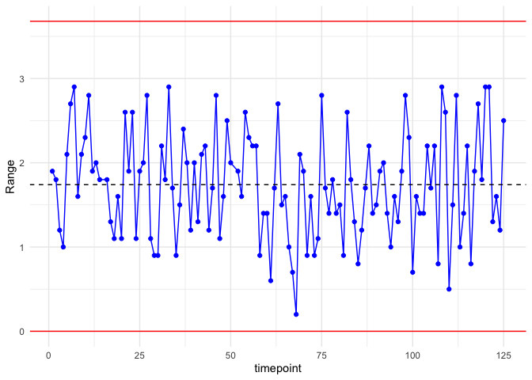
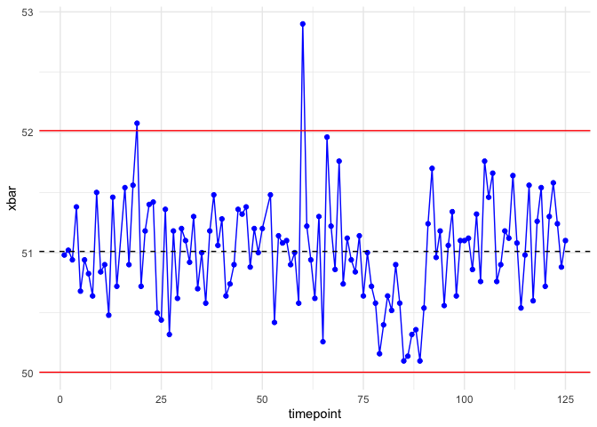
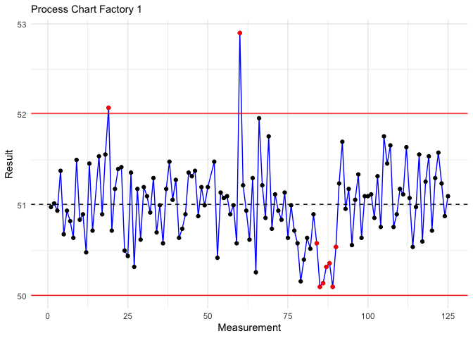
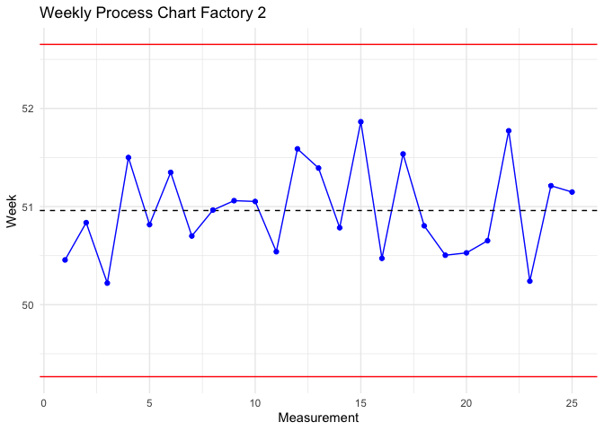
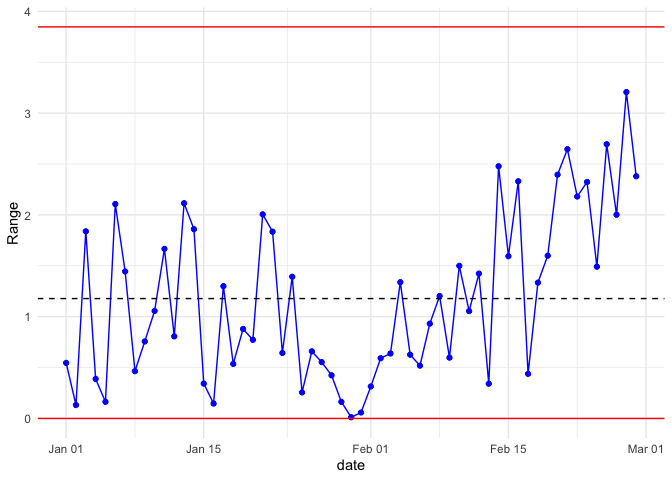

Report\_1
================

### Opening necessary in the project libraries

# Part 1

  - Importing data

<!-- end list -->

``` r
## Importing data

cheese_data <- read_csv("Resources/cheese_data.csv") %>%
  janitor::clean_names()

## Storing data for factory 1

cheese_data_f1 <- cheese_data %>%
  filter(factory %in% "f1")

## Storing data for factory 2

cheese_data_f2 <- cheese_data %>%
  filter(factory %in% "f2")
```

This report starts with importing the data from the csv file. Two sets
of data are saved separately for Factory 1 and for Factory 2.

# Part 2

  - Cleaning the data
  - Managing missing values

<!-- end list -->

``` r
## Transponing the table

cheese_data_long <- cheese_data %>%
  pivot_longer(
    cols = c("m1", "m2", "m3", "m4", "m5"),
    names_to = "measure",
    values_to = "result"
  )

## How many missing values have to be replaced?

miss_values <- cheese_data_long %>%
  filter(result == 0) %>%
  nrow()

## How many timepoints have to be discarded?

discard_timepoints_num <- cheese_data_long %>%
  group_by(factory, timepoint) %>%
  mutate(num_NA = sum(if_else(result == 0, 1, 0))) %>%
  filter(num_NA >= 2) %>%
  dplyr::select (timepoint) %>%
  distinct() %>%
  nrow()

## What timepoints have to be discarded?

discard_time <- cheese_data_long %>%
  group_by(factory, timepoint) %>%
  mutate(num_NA = sum(if_else(result == 0, 1, 0))) %>%
  filter(num_NA >= 2) %>%
  dplyr::select (timepoint) %>%
  distinct() %>%
  pull(timepoint)

## Discarding missing values

cheese_data_long <- cheese_data_long %>%
  filter(!(timepoint %in% discard_time))

## Replacing missing values

cheese_data_long <- cheese_data_long %>%
  group_by(factory, timepoint) %>%
  mutate(
    result = na_if(result, 0),
    AVG_result = mean(result, na.rm = TRUE),
    result = if_else(is.na(result), AVG_result, result)
  )
```

In the next step the data is transponed in order to carry out further
calculations. Missing and uexpected values are detected.  
From the obtained results we can see that **7** missing values needed to
be replaced. These values were replaced with average value calculated
based on the same factory and timepoint.  
Additionally **2** timepoints were discard.

# Part 3

  - Cleaning the data
  - Managing unexpected values

<!-- end list -->

``` r
## How many unexpected values are you able to detect?

unexpected_value <- cheese_data_long %>%
  filter(result > 65 | result < 15) %>%
  nrow()

## Checking in which factory unexcpected values appears

unexpected_value_factory <- cheese_data_long %>%
filter(result > 65 | result < 15) %>%
mutate(factory_num = str_sub (factory,2,2)) %>%
pull (factory_num)

## Replacing unexpected values with average for this group

cheese_data_long <-  cheese_data_long %>%
  mutate(
    result = if_else(result > 65 | result < 15, 0, result),
    result = na_if(result, 0),
    AVG_result = mean(result, na.rm = TRUE),
    result = if_else(is.na(result), AVG_result, result)
  ) 
```

Looking closer at unexpected values, so values lower than 15 and higher
than 65. I was able to detect 1 unexpected value. This value appeared in
the Factory 1. After identyfing unexcpected values, I recalculated
average results and repleced them with the new average calculated based
on the factory and timepoint.

# Part 4

  - Computing monitoring statistics for factory
f1

<!-- end list -->

``` r
# Storing the resulting values, xbar and Range, in a tibble named spc_data_f1.

spc_data_f1 <- cheese_data_long %>%
  filter(factory %in% "f1") %>%
  group_by(timepoint) %>%
  mutate(
    xbar = AVG_result,
    xmin = min(result),
    xmax = max(result),
    Range = (xmax - xmin)
  ) %>%
  ungroup() %>%
  dplyr::select (timepoint, xbar, Range,week, factory) %>%
  distinct()

## How many rows does the tibble spc_data_f1 have?

data_f1_rows <- spc_data_f1 %>%
  nrow()

## Computing the average of xbar and Range values.

avg_range_f1 <- spc_data_f1 %>%
  summarise(avg_range_f1 = round(mean(Range), 2)) %>%
  pull()

avg_xbar_f1 <- spc_data_f1 %>%
  summarise(avg_xbar_f1 = round(mean(xbar), 2)) %>%
  pull()
```

Going over to monitoring statistics for Factory 1:  
The spc\_data\_f1 tibble has **123** rows.  
The average of xbar is **51.01**.  
The average of range values is **1.74**.

# Part 5

  - Building Shewhart control charts for factory f1

<!-- end list -->

``` r
## Importing data

xbar_constants <- read_csv("Resources/XbarR_constants.csv") %>%
  janitor::clean_names()

d3 <- xbar_constants %>%
  filter(n == 5) %>%
  pull(d3_2)

d4 <- xbar_constants %>%
  filter(n == 5) %>%
  pull(d4)

a2 <- xbar_constants %>%
  filter(n == 5) %>%
  pull(a2)

## Adding LCL and UCL values

LCL_range_f1 <- avg_range_f1 * d3
UCL_range_f1 <- avg_range_f1 * d4

LCL_xbar_f1 <- avg_xbar_f1 - a2 * avg_range_f1
UCL_xbar_f1 <- avg_xbar_f1 + a2 * avg_range_f1

## Producing an R chart (lineplot of Range vs. timepoint).

spc_data_f1 %>%
  ggplot(mapping = aes(x = timepoint, y = Range)) +
  geom_line(color = 'blue') +
  geom_point(color = 'blue') +
  geom_hline(yintercept = LCL_range_f1, color = "red") +
  geom_hline(yintercept = UCL_range_f1, color = "red") +
  geom_hline(yintercept = avg_range_f1, linetype = 'dashed') +
  theme_minimal()
```

<!-- -->

In this part of the report Shewhart control charts are being
presented.  
Starting with the graph above, we can see R chart that shows data for
Factory 1. Red lines on the chart highlights Lower and Upper Control
Limits and dashed line avarage range value for Factory 1. Each point on
the graph presents range of values for specific timepoint.

``` r
## Producing an xbar chart (lineplot of xbar vs. timepoint).

spc_data_f1 %>%
  ggplot(mapping = aes(x = timepoint, y = xbar)) +
  geom_line(color = 'blue') +
  geom_point(color = 'blue') +
  geom_hline(yintercept = LCL_xbar_f1, color = "red") +
  geom_hline(yintercept = UCL_xbar_f1, color = "red") +
  geom_hline(yintercept = avg_xbar_f1, linetype = 'dashed') +
  theme_minimal()
```

<!-- -->

Now going over to Xbar chart we can see again data presented for
Factory1. Red lines on the chart highlights Lower and Upper Control
Limits and dashed line avarage value for Factory 1. Each point on the
graph presents average value for specific timepoint.

# Part 6

  - Highlighting special causes of variations

<!-- end list -->

``` r
## Preparing function

all_gte_ref_value_f1 <- function(x)
  all(x >= avg_xbar_f1)
all_low_ref_value_f1 <- function(x)
  all(x <= avg_xbar_f1)

## Saving red points

red_point_f1 <- spc_data_f1 %>%
  mutate(
    tenlow = slide_lgl(
      .x = xbar,
      .f = all_low_ref_value_f1,
      .before = 9,
      .complete = TRUE
    ),
    tenhigh = slide_lgl(
      .x = xbar,
      .f = all_gte_ref_value_f1,
      .before = 9,
      .complete = TRUE
    )
  ) %>%
  filter(tenlow == "TRUE" |
           tenhigh == "TRUE" | xbar > UCL_xbar_f1 | xbar < LCL_xbar_f1)

## Creating control chart with highlights

xbar_f1 <- spc_data_f1 %>%
  ggplot(mapping = aes(x = timepoint, y = xbar)) +
  geom_line(color = 'blue') +
  geom_hline(yintercept = LCL_xbar_f1, color = "red") +
  geom_hline(yintercept = UCL_xbar_f1, color = "red") +
  geom_hline(yintercept = avg_xbar_f1, linetype = 'dashed') +
  geom_point() +
  geom_point(data = red_point_f1, color = "red") +
  theme_minimal() +
  labs(subtitle = "Process Chart Factory 1",
       x = "Measurement",
       y = "Result")

xbar_f1
```

<!-- -->

In this part of the report special causes of variations have been
highlighted. Specific point counts as a special cause if it’s outside of
the control limits or if there are ten or more consecutive points on one
side of the centerline. Special causes are highlighted in red on the
above chart. We can notice that for factory 1 we obtained 8 such cases.

# Part 7

  - Building Shewhart control charts for factory
f2

<!-- end list -->

``` r
# Storing the resulting values, xbar and Range, in a tibble named spc_data_f2.

spc_data_f2 <- cheese_data_long %>%
  filter(factory %in% "f2") %>%
  group_by(timepoint) %>%
  mutate(
    xbar = AVG_result,
    xmin = min(result),
    xmax = max(result),
    Range = (xmax - xmin)
  ) %>%
  ungroup() %>%
  dplyr::select (timepoint, xbar, Range,week, factory) %>%
  distinct()

## Computing the average of xbar and Range values.

avg_range_f2 <- spc_data_f2 %>%
  summarise(avg_range_f2 = mean(Range)) %>%
  pull()

avg_xbar_f2 <- spc_data_f2 %>%
  summarise(avg_xbar_f2 = mean(xbar)) %>%
  pull()

## Adding LCL and UCL values

LCL_range_f2 <- avg_range_f2 * d3
UCL_range_f2 <- avg_range_f2 * d4

LCL_xbar_f2 <- avg_xbar_f2 - a2 * avg_range_f2
UCL_xbar_f2 <- avg_xbar_f2 + a2 * avg_range_f2

## Producing an R chart (lineplot of Range vs. timepoint).

spc_data_f2 %>%
  ggplot(mapping = aes(x = timepoint, y = Range)) +
  geom_line(color = 'blue') +
  geom_hline(yintercept = LCL_range_f2, color = "red") +
  geom_hline(yintercept = UCL_range_f2, color = "red") +
  geom_hline(yintercept = avg_range_f2, linetype = 'dashed') +
  theme_minimal()
```

<!-- -->

Now we are moving to present Shewhart control charts for Factory 2.  
The graph above shows R chart. Red lines highlights Lower and Upper
Control Limits and dashed line avarage range value for Factory 2. Each
point on the graph presents range of values for specific timepoint.

``` r
## Preparing function

all_gte_ref_value_f2 <- function(x)
  all(x >= avg_xbar_f2)
all_low_ref_value_f2 <- function(x)
  all(x <= avg_xbar_f2)

## Saving red points

red_point_f2 <- spc_data_f2 %>%
  mutate(
    tenlow = slide_lgl(
      .x = xbar,
      .f = all_low_ref_value_f2,
      .before = 9,
      .complete = TRUE
    ),
    tenhigh = slide_lgl(
      .x = xbar,
      .f = all_gte_ref_value_f2,
      .before = 9,
      .complete = TRUE
    )
  ) %>%
  filter(tenlow == "TRUE" |
           tenhigh == "TRUE" | xbar > UCL_xbar_f2 | xbar < LCL_xbar_f2)

## Producing an xbar chart (lineplot of xbar vs. timepoint).

xbar_f2 <- spc_data_f2 %>%
  ggplot(mapping = aes(x = timepoint, y = xbar)) +
  geom_line() +
  geom_hline(yintercept = LCL_xbar_f2, color = "red") +
  geom_hline(yintercept = UCL_xbar_f2, color = "red") +
  geom_hline(yintercept = avg_xbar_f2, linetype = 'dashed') +
  geom_point() +
  geom_point(data = red_point_f2, color = "red") +
  theme_minimal() +
  labs(subtitle = "Process Chart Factory 2",
       x = "Measurement",
       y = "Result")

xbar_f2
```

<!-- -->

On the Xbar chart above we can see again data for Factory 2. Red lines
on the chart highlights Lower and Upper Control Limits and dashed line
avarage value for Factory 1. Each point on the graph presents average
value for specific timepoint. We can notice right away here that we
received many more special causes than in case of Factory 1.

``` r
## Do we observe similar patterns in xbar charts of both factories?

xbar_f1 / xbar_f2
```

<!-- -->

Now it’s time to compare results between two these two factories.  
We can see that patterns for this two factories are different. Factory 1
has results more spreaded per one timepoint, while for Factory 2 values
are more cummulated. In general values for Factory 1 devates more than
for Factory 2, which could mean that process for Factory 2 is more
stable.

``` r
## Producing a scatterplot of xbar values vs. week for both factories f1 and f2.

scatter_data <- cheese_data_long %>%
  group_by(timepoint, week, factory) %>%
  mutate(
    xbar = AVG_result,
     factory = if_else(factory == "f1", "Factory 1", "Factory 2"),
    week = as.factor(week)
  ) %>%
  ungroup() %>%
  dplyr::select (timepoint, xbar, week, factory) %>%
  distinct()

ggplot() +
  geom_point(scatter_data, mapping = (aes(
    x = week, y = xbar, color = factory
  ))) +
  theme_minimal() +
  geom_point(data = red_point_f1 %>%
                mutate(factory = if_else(factory == "f1", "Factory 1", "Factory 2")),
             mapping = aes(x = week, y = xbar), color = "black") +
  geom_point(data = red_point_f2 %>%
              mutate(factory = if_else(factory == "f1", "Factory 1", "Factory 2")),
             mapping = aes(x = week, y = xbar), color = "black") +
  facet_grid( vars(row = factory)) +
  labs(title = "Scatterplot of xbar values vs. week",
       x = "Week",
       y = "Result") +
  theme(legend.position = "none")
```

<!-- -->

From the obtained scatterplot we can confirm previous assumptions that
values for Factory 2 are cummulated and for Factory 1 more spread.  
We can see as well that for Factory 2 we have many more special causes.

# Part 8

  - Redefining monitoring data for factory f2

<!-- end list -->

``` r
week_avg_f2 <- cheese_data_long %>%
  ungroup() %>%
  filter(factory %in% "f2") %>%
  group_by(week) %>%
  summarise(avg_week = mean(result)) %>%
  dplyr::select(week, avg_week)

M <- week_avg_f2 %>%
  summarise(M = mean(avg_week)) %>%
  pull(M)

MR_bar <- week_avg_f2 %>%
  mutate(prev_avg = lag(avg_week),
         MR = abs(avg_week - prev_avg)) %>%
  summarise(MR_bar = mean(MR, na.rm = TRUE)) %>%
  pull(MR_bar)

LCL_mr <- M - 2.66 * MR_bar
UCL_mr <- M + 2.66 * MR_bar


week_avg_f2  %>%
  ggplot(mapping = aes(x = week, y = avg_week)) +
  geom_line(color = 'blue') +
  geom_hline(yintercept = LCL_mr, color = "red") +
  geom_hline(yintercept = UCL_mr, color = "red") +
  geom_hline(yintercept = M , linetype = 'dashed') +
  geom_point(color = 'blue') +
  theme_minimal() +
  labs(title = "Weekly Process Chart Factory 2",
       x = "Measurement",
       y = "Week")
```

<!-- -->

Above chart presents redifined weekly average values for Factory 2. Here
again red lines highlights Lower and Upper Control Limits and dashed
line avarage value.

# Part 9 - open ended question

  - Producing a control chart using my own data

<!-- end list -->

``` r
## Importing data

cow_data <- read_xlsx("Resources/milk_cow.xlsx") %>%
  janitor::clean_names()

## Clearing dates

cow_data <- cow_data %>%
  mutate(date = date(date_time),
         time = hour(date_time)) %>%
  dplyr:: select(date,
                 milk_prod = "milk_prod_per_cow_kg",
                 time)

# Storing the resulting values, xbar and Range

spc_cow_data <- cow_data %>%
  group_by(date) %>%
  mutate(
    xbar = mean(milk_prod, na.rm = TRUE),
    xmin = min(milk_prod),
    xmax = max(milk_prod),
    Range = (xmax - xmin)
  ) %>%
  ungroup() %>%
  dplyr::select (date, xbar, Range) %>%
  distinct()


## Computing the average of xbar and Range values.

avg_range_cow <- spc_cow_data %>%
  summarise(avg_range_cow = mean(Range)) %>%
  pull()

avg_xbar_cow <- spc_cow_data %>%
  summarise(avg_xbar_cow = mean(xbar)) %>%
  pull()

## Importing xbar constants

b3 <- xbar_constants %>%
  filter(n == 2) %>%
  pull(d3_2)

b4 <- xbar_constants %>%
  filter(n == 2) %>%
  pull(d4)

g2 <- xbar_constants %>%
  filter(n == 2) %>%
  pull(a2)

## Adding LCL and UCL values

LCL_range_cow <- avg_range_cow * b3
UCL_range_cow <- avg_range_cow * b4

LCL_xbar_cow <- avg_xbar_cow - g2 * avg_range_cow
UCL_xbar_cow <- avg_xbar_cow + g2 * avg_range_cow

## Preparing inline text

min_date <- cow_data %>%
  summarise(min(date))

max_date <- cow_data %>%
  summarise(max(date))

min_time <- cow_data %>%
  summarise(min(time))

max_time <- cow_data %>%
  summarise(max(time))
```

Presented in this part data comes from this [GitHub
Account](https://github.com/ourcodingclub/CC-time-series).  
In this data set we have information about cow milking done in the
traditional way.  
This measurement were taken between 1975-01-01 and 1975-02-28. For every
day of this time period we have two results, from 5 and 17.

``` r
## Producing an R chart 

spc_cow_data %>%
  ggplot(mapping = aes(x = date, y = Range)) +
  geom_line(color = 'blue') +
  geom_point(color = 'blue') +
  geom_hline(yintercept = LCL_range_cow, color = "red") +
  geom_hline(yintercept = UCL_range_cow, color = "red") +
  geom_hline(yintercept = avg_range_cow, linetype = 'dashed') +
  theme_minimal()
```

<!-- -->

From the obtained chart we can see that values are crossing slightly the
LCL range. As the traditional milking process is not that stable as the
one in the factory we can notice more spread values than on the previous
charts for Factory 1 and 2.

``` r
## Producing an xbar chart 

spc_cow_data %>%
  ggplot(mapping = aes(x = date, y = xbar)) +
  geom_line(color = 'blue') +
  geom_point(color = 'blue') +
  geom_hline(yintercept = LCL_xbar_cow, color = "red") +
  geom_hline(yintercept = UCL_xbar_cow, color = "red") +
  geom_hline(yintercept = avg_xbar_cow, linetype = 'dashed') +
  theme_minimal()
```

<!-- -->

From the obtained chart we can noticed that values are changing over the
time but are almost always within the range. Here again compering to
results from factory it seems like this traditional process is less
stable.
