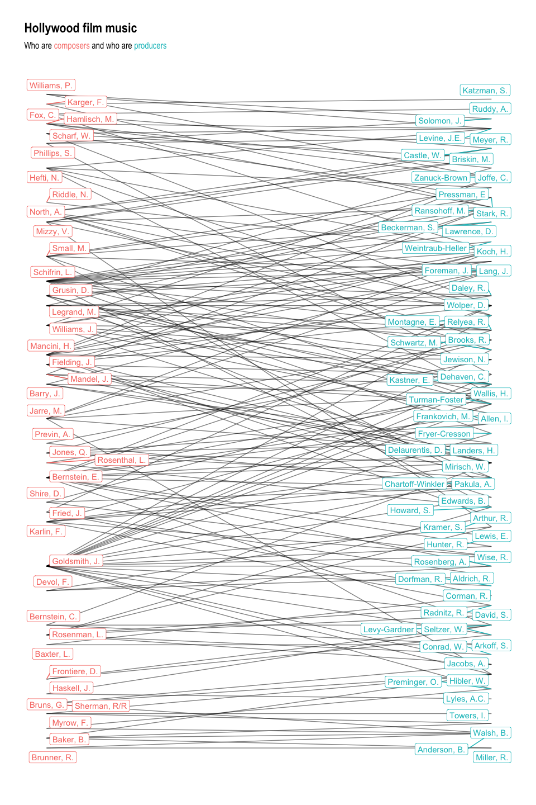
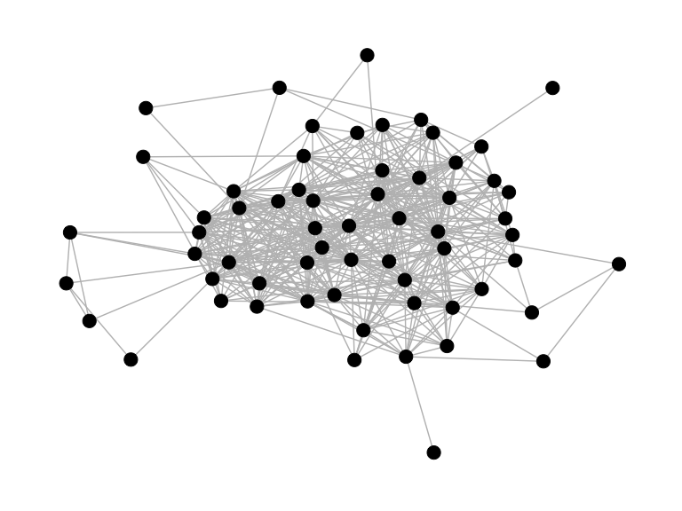
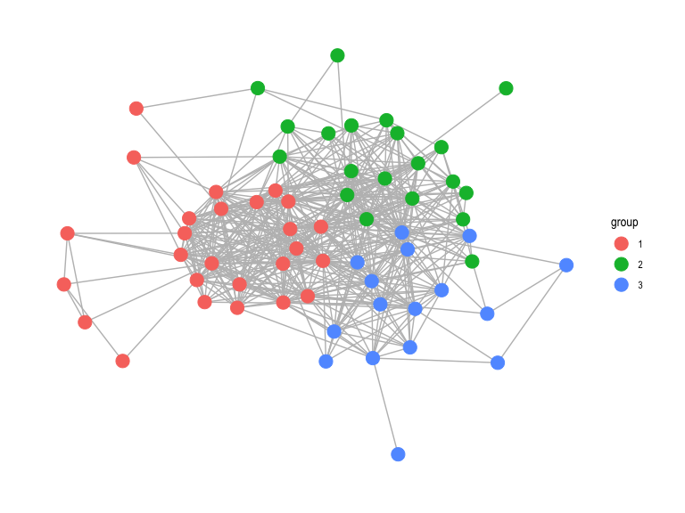
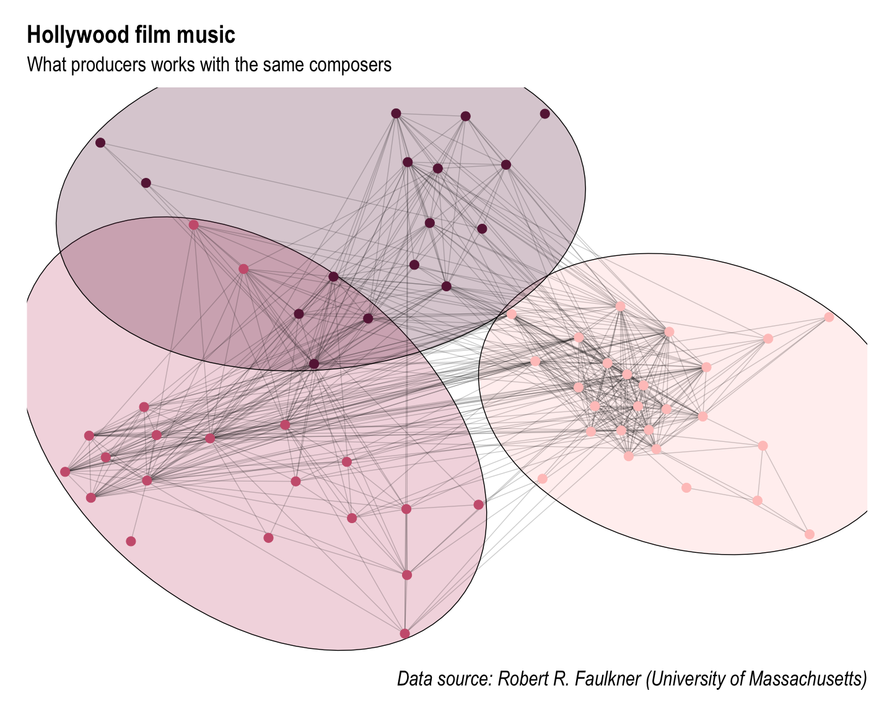

Report\_2
================

### Opening necessary in the project libraries

# Part 1

  - Importing the data

<!-- end list -->

``` r
## Importing data

movies <- read_delim("Resources/Movies.paj", delim = " ") %>%
  clean_names()

## Creating nodes tibble

from_name_nod <- '*Vertices'
to_name_nod <- '*Arcs'

from_id_nod = which(movies == from_name_nod)[1] + 1
to_id_nod = which(movies == to_name_nod) - 1

movie_nodes <- movies [from_id_nod:to_id_nod,] %>%
  as_tibble() %>%
  mutate(network = as.numeric(network)) %>%
  dplyr::select(node_id = "network",
                name = "movies_net")

## Creating edges tibble

from_name_edg <- '*Edges'
to_name_edg <- '*Partition'

from_id_edg = which(movies == from_name_edg) + 1
to_id_edg = which(movies == to_name_edg) - 1

movie_edges <- movies [from_id_edg:to_id_edg,] %>%
  as_tibble() %>%
  filter(!is.na(network) & !is.na(movies_net)) %>%
  dplyr::mutate(
    from = as.numeric(network),
    to = as.numeric(movies_net),
    n_collabs = as.numeric(x2_mode)
  ) %>%
  dplyr::select(from, to, n_collabs)

## Checking edges

dist_edg_from <- movie_edges %>%
  dplyr::select(from) %>%
  distinct() %>%
  pull()

dist_edg_to <- movie_edges %>%
  dplyr::select(to) %>%
  distinct() %>%
  pull()

dist_edg <- unique(c(dist_edg_from, dist_edg_to))

## Adding composer/procudent column

movie_nodes <- movie_nodes %>%
  mutate(role = if_else(node_id %in% dist_edg_from, "Producer", "Composer"))

## Combining data

movie_network <- tbl_graph(nodes = movie_nodes,
                           edges = movie_edges,
                           directed = TRUE)

## Filtering data

movie_network <- movie_network %>%
  activate(nodes) %>%
  filter(node_id %in% dist_edg)
```

# Part 2

  - Visualizing the data
  - Styling the network

<!-- end list -->

``` r
## Plotting the network

movie_network %>%
  ggraph() +
  geom_edge_link2(alpha = 0.5) +
  geom_node_label(aes(colour = role, label = name), repel = TRUE) +
  coord_flip() +
  theme(legend.position = 'none') +
  labs(
    title = 'Hollywood film music',
    subtitle = str_glue(
      "<span>",
      "Who are ",
      "<p style='color:#F88079;'>",
      "composers ",
      "</p>",
      "and who are ",
      "<p style='color:#01BFC4;'>producers </p>",
      "</span>"
    )
  ) +
  theme_graph() +
  theme(legend.position = "none") +
  theme(plot.title = ggtext::element_markdown(),
        plot.subtitle = element_markdown())
```



Obtained graph is very messy and we cannot read easily what composer
work with what producer.  
Unfortunately having 62 producers and 40 composers makes it impossible
to present it clearly on one graph.

# Part 3

  - Presenting which producers worked with the same composers

<!-- end list -->

``` r
## Creating network only with producers

producer_nodes <- movie_network %>%
  activate(nodes) %>%
  as_tibble() %>%
  filter(role == "Producer")

## Finding producers who work with the same composers

producer_edges <- movie_network %>%
  activate(edges) %>%
  as_tibble() %>%
  group_by(to) %>%
  mutate(new_from = list(unique(from))) %>%
  unnest_longer(new_from) %>%
  filter(from != new_from) %>%
  ungroup() %>%
  dplyr::select(to = from, from = new_from)

## Creating new network

producer_network <-
  tbl_graph(producer_nodes, producer_edges, directed = FALSE)

## Removing duplicated edges

producer_edges  <- producer_network %>%
  activate(edges) %>%
  as_tibble() %>%
  unique ()

## Creating new network

producer_network <-
  tbl_graph(producer_nodes, producer_edges, directed = FALSE)

## Creating initial visualization of the network

producer_network %>%
  ggraph() +
  geom_edge_link(colour = 'grey') +
  geom_node_point(size = 5) +
  theme_graph()
```



Above graph presents connections between different producers who worked
together with the same composers.  
As we have in total 62 producers to present this visualization is still
not readable.

# Part 4

  - Presenting if there are clusters in the network.
  - Checking if producers tend to work with the same composer.
  - Using a clustering algorithm.

<!-- end list -->

``` r
## Grouping data

producer_network_cluster <-
  producer_network %>%
  activate(nodes) %>%
  mutate(group = group_leading_eigen())

## Presenting clustered graph

producer_network_cluster  %>%
  mutate(group = as.factor(group)) %>%
  ggraph() +
  geom_edge_link(colour = "grey") +
  geom_node_point(aes(colour = group), size = 5) +
  theme_graph()
```



After clustering data I received 3 different groups.  
It seems like there are many connections between different producers
which means that many producers work with the same composers. Producers
grouped together are most likely to work with the same composers.

# Part 5

  - Touching up above graph.
  - Adding shaded colour background for each cluster.
  - Adding a personal theme.

<!-- end list -->

``` r
## Polishing up the graph

producer_network_cluster  %>%
  mutate(group = as.factor(group)) %>%
  ggraph(layout = 'backbone') +
  ggforce::geom_mark_ellipse(
    mapping = aes(x, y, group = group, fill = group),
    concavity = 10,
    expand = unit(4, 'mm'),
    alpha = 0.25
  ) +
  rcartocolor::scale_fill_carto_d(palette = "Burg", guide = FALSE) +
  geom_edge_link(alpha = 0.2) +
  geom_node_point(aes(colour = group), size = 5) +
  rcartocolor::scale_colour_carto_d(palette = 'Burg', guide = FALSE) +
  labs(title = 'Hollywood film music',
       subtitle = 'What producers works with the same composers',
       caption = 'Data source: Robert R. Faulkner (University of Massachusetts)') +
  theme_graph() +
  theme(
    plot.title = element_text(size = 30),
    plot.subtitle = element_text(size = 25),
    plot.caption = element_text(size = 25)
  )
```


