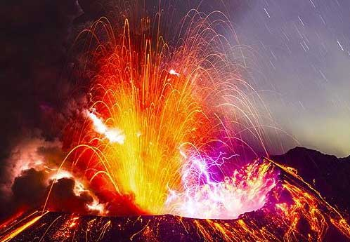

```{r echo=FALSE, message=FALSE, warning=FALSE}
### Opening necessary in the project libraries

library(stringr)
library(janitor)
library(lubridate)
library(tidyverse)
library(gganimate)
library(kableExtra)
library(knitr)
library(prettydoc)
library(sf)
library(raster)
library(tmap)
```


```{r echo=FALSE, message=FALSE, warning=FALSE, out.width="75%", results=FALSE}

## Adding volcano pic



```

# What is a volcano?   

*A volcano is a rupture in the crust of a planetary-mass object, such as Earth, that allows hot lava, volcanic ash, and gases to escape from a magma chamber below the surface.*

## Why we have volcanos?  

*Earth's volcanoes occur because its crust is broken into 17 major, rigid tectonic plates that float on a hotter, softer layer in its mantle. Therefore, on Earth, volcanoes are generally found where tectonic plates are diverging or converging, and most are found underwater.*   
[Wikipedia](https://en.wikipedia.org/wiki/Volcano)

```{r echo=FALSE, message=FALSE, warning=FALSE, results = 'hide'}

## Importing data

volcano <- readr::read_csv('https://raw.githubusercontent.com/rfordatascience/tidytuesday/master/data/2020/2020-05-12/volcano.csv')
eruptions <- readr::read_csv('https://raw.githubusercontent.com/rfordatascience/tidytuesday/master/data/2020/2020-05-12/eruptions.csv')
events <- readr::read_csv('https://raw.githubusercontent.com/rfordatascience/tidytuesday/master/data/2020/2020-05-12/events.csv')
tree_rings <- readr::read_csv('https://raw.githubusercontent.com/rfordatascience/tidytuesday/master/data/2020/2020-05-12/tree_rings.csv')
sulfur <- readr::read_csv('https://raw.githubusercontent.com/rfordatascience/tidytuesday/master/data/2020/2020-05-12/sulfur.csv')

## Calculating countries with volcanos

sum_volc_country <- volcano %>%
  group_by(country) %>%
  summarise(volcanos= n()) %>%
  arrange(desc(volcanos)) 

## Preparing map

world_border <- sf::st_read('/Users/magda/Documents/EPFL/Final_Project_2/Report_3/Resources/ne_50m_admin_0_countries/ne_50m_admin_0_countries.shp') %>%
  clean_names() %>%
  mutate(name = ifelse(name =="United States of America","United States",name))

## I couldn't upload so much that, but this is a file used in the Project3

world_volcano  <-  world_border  %>% 
  left_join(sum_volc_country, by= c("name"="country")) %>%
  st_transform(crs ='ESRI:54011')

```


```{r echo=FALSE, message=FALSE, warning=FALSE, fig.align='center', fig.cap ='Volcanos in the World'}

## Creating map

tm_shape(world_volcano) +
tm_polygons(col = "volcanos", 
              style = "quantile",
            palette = "-plasma") +
tm_polygons(col = "#2887a1") +
  tm_layout(frame ='#5f007f',frame.lwd=5)
```


```{r echo=FALSE, message=FALSE, warning=FALSE}

## Calculating number of volcanos per country

sum_volc_country_t <- volcano %>%
  group_by(country) %>%
  summarise(Volcanos= n()) %>%
  arrange(desc(Volcanos)) %>%
  rename(Country ='country') %>%
  head(5)

## Inline text

volc_top_country <- sum_volc_country_t %>%
  head(1) %>%
  pull(Country)

volc_top_num <- sum_volc_country_t %>%
  head(1) %>%
  pull(Volcanos)

## Displaying table with top countries

sum_volc_country_t %>%
  kableExtra::kable() %>%
  kableExtra::kable_styling(bootstrap_options = 'hover',position = "float_right", font_size = 10,full_width = F) %>%
  kableExtra::column_spec(2,color = '#5f007f', background = "#efedf5",bold = T) %>%
  kableExtra::column_spec(1, background = "#efedf5")
```

On the above map we can see where volcanos are located around the world. 
We can notice that the biggest number of them is in North America, Indonesia and Antarcica. 
On the other hand there are many countries like Brazil or Greenland, where are no volcanos.  
On the right hand side, we can see a table with top 5 countries with biggest number of volcanos in the world.   
On top of this list we can see `r volc_top_country` with the biggest number of `r volc_top_num` volcanos. 

```{r echo=FALSE, message=FALSE, warning=FALSE, results = 'hide'}

## List of countries with most number of volcanos

top_volc_country <- sum_volc_country_t %>%   
  pull(Country)   

## Checking number of confirmed eruptions

conf_erup <- eruptions %>% 
  left_join(volcano, by=("volcano_number"="volcano_number")) %>%
  mutate(confirmed = str_detect(eruption_category, "Confirmed")) %>%
  filter(confirmed == TRUE & !is.na(country))

## Checking number of confirmed eruptions per country

sum_erup_country <- conf_erup %>%
  group_by(country) %>%
  summarise(erup_sum= n()) 

## Preparing list with countries with most number of eruptions

top_erup_country <- sum_erup_country %>%   
  arrange(desc(erup_sum)) %>%
  head(5)  %>%
  pull(country)

## Preparing map

world_erup  <-  world_border  %>% 
  left_join(sum_erup_country, c("name" = "country")) %>%
  st_transform(crs = 'ESRI:54011')
```


```{r echo=FALSE, message=FALSE, warning=FALSE, fig.align='center', fig.cap ='Eruptions in the World'}

tm_shape(world_erup) +
tm_polygons(col = "erup_sum", 
              style = "quantile",
            palette = "-plasma") +
  tm_polygons(col = "#2887a1") +
  tm_layout(frame ='#5f007f',frame.lwd=5)

```


```{r echo=FALSE, message=FALSE, warning=FALSE}

## Calculating number of volcanos per country

sum_erup_country_t <- conf_erup %>%
  group_by(country) %>%
  summarise(Eruptions= n()) %>%
  arrange(desc(Eruptions)) %>%
  rename(Country ='country') %>%
  head(5)

## Inline text

erup_top_country <- sum_erup_country_t %>%
  head(1) %>%
  pull(Country)

erup_top_num <- sum_erup_country_t %>%
  head(1) %>%
  pull(Eruptions)

## Displaying table with top countries

sum_erup_country_t %>%
  kableExtra::kable() %>%
  kableExtra::kable_styling(bootstrap_options = 'hover',position = "float_left", font_size = 10,full_width = F) %>%
  kableExtra::column_spec(2,color = '#5f007f', background = "#efedf5",bold = T) %>%
   kableExtra::column_spec(1, background = "#efedf5")
```

On the above map we can see where volcanos eruptions are taking place in the world.
It seems like biggest number of them is in the US, Italy, France, Mexico and Indonesia.  
There are some countries like South Africa or Germany where volcanos are located, but the eruptions almost never happend.  
On the left hand side we see a table with countries with the most number of volcanos.
On top of this list we can see `r erup_top_country` with the biggest number of `r erup_top_num` eruptions. 

```{r echo=FALSE, message=FALSE, warning=FALSE}

```

**Let's observe now how number of eruptions was changing over centuries.**

```{r echo=FALSE, message=FALSE, warning=FALSE, fig.align="center"}

erup_1000 <- conf_erup %>%
  filter(start_year > 0 & start_year < 2000) %>%
  mutate(century = ceiling(start_year/100)) %>%
  group_by(century) %>%
  summarise(sum_erup_1000 = n())

         
erup_1000  %>%
  ggplot(aes(x = century, y = sum_erup_1000)) +
  geom_point(alpha = 0.7, color = '#5f007f') +
  theme_minimal() +
  theme(legend.position = "none") +
  scale_y_continuous(trans = "log10") +
  scale_x_continuous(breaks = seq(1, 20, by = 1)) +
  theme(axis.text.x = element_text( size=10)) +
  transition_states(
    century,
    transition_length = 1,
    state_length = 1)+
    labs(
    title = "Century: {closest_state}",
    x = "Century",
    y = "Number of eruptions"
  )+
  shadow_mark()
```

On the above vizualization we can observe that from the 15th century number of volcano eruptions started rapidly increasing around the world.  
This probably is caused by the fact that from that time people started recording better data about them.  
Especially that this graph has a logarytmical axis we can see that numbers for recent decades are significantly higher.

**Let's take a look closer at 20th century!**

```{r echo=FALSE, message=FALSE, warning=FALSE, fig.align="center"}

erup_year <- conf_erup %>%
  filter(start_year > 1900 & start_year < 2000 & country == top_erup_country ) %>%
  mutate(sto_erup = as.integer(str_sub(start_year,3,3))+1)%>%
  group_by(country,sto_erup) %>%
  summarise(erup_sumyear =n()) 


erup_year  %>%
  ggplot(aes(x = country, y = erup_sumyear)) +
  geom_col(alpha = 0.7, fill = '#5f007f') +
  theme_minimal() +
  theme(legend.position = "none") +
  theme(axis.text.x = element_text(angle = 90, size=10)) +
  transition_states(
    sto_erup,
    transition_length = 2,
    state_length = 2)+
    labs(
    title = "20th century decade: {closest_state}",
    x = "Five Top Countries",
    y = "Number of eruptions"
  )+
  enter_grow()
```

On the above vizualization we can see how number of eruptions were changing for decades of the 20th century.
Selected 5 countries are countries with the most number eruptions over all years.
We can see that these numbers are changing randomly and there is no easy to notice pattern in it.
For some countries there are decades when eruptions didn't happen. 

**How long actually the eruptions takes?**

```{r echo=FALSE, message=FALSE, warning=FALSE,fig.align="center"}

## calculating eruption time

conf_erup_time <- conf_erup %>%
  filter(country == top_erup_country)%>%
  mutate(start_date = dmy(str_c(start_day,start_month,start_year,sep= "/")),
         end_date = dmy(str_c(end_day,end_month,end_year,sep= "/"))) %>%
    filter(!is.na(start_date) & !is.na(end_date))%>%
  mutate(erup_time = difftime(end_date,start_date ,units="days")) %>%
  group_by(country) %>%
  summarise(avg_country = as.numeric(round(mean(erup_time)))) %>%
  arrange(avg_country) %>%
  mutate(country =fct_inorder(country)) 

## Inline text

long_erup <- conf_erup_time %>%
  arrange(desc(avg_country)) %>%
  head(1) %>%
  pull(country)

short_erup <- conf_erup_time %>%
  arrange(avg_country) %>%
  head(1) %>%
  pull(country)
  
## Average length per country

conf_erup_time %>%
  ggplot(aes(y=avg_country, x=country))+
  geom_point(color ='#5f007f') +
  theme_minimal() +
        labs(
            title = "How long?",
            subtitle = "Average time of volcano eruptions",
            x = "Five Top Countries",
            y = "Days")
  
```

We can see on the graph above how much time different volcano eruptions takes. 
For every country, obtained average is complately different and it varies from around 40 to 250 days. 
The longest volcano eruption seems to be in `r long_erup` and the shortes in `r short_erup`.
