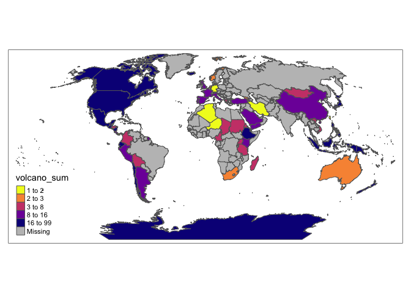
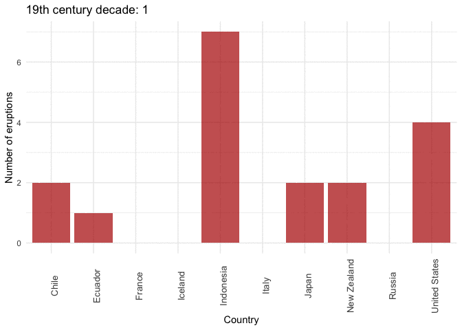
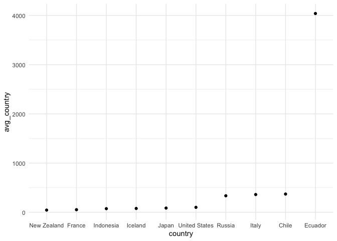

Report\_4
================

### Opening necessary in the project libraries

Part 1

``` r
## Importing data

volcano <- readr::read_csv('https://raw.githubusercontent.com/rfordatascience/tidytuesday/master/data/2020/2020-05-12/volcano.csv')
```

    ## 
    ## ── Column specification ────────────────────────────────────────────────────────
    ## cols(
    ##   .default = col_character(),
    ##   volcano_number = col_double(),
    ##   latitude = col_double(),
    ##   longitude = col_double(),
    ##   elevation = col_double(),
    ##   population_within_5_km = col_double(),
    ##   population_within_10_km = col_double(),
    ##   population_within_30_km = col_double(),
    ##   population_within_100_km = col_double()
    ## )
    ## ℹ Use `spec()` for the full column specifications.

``` r
eruptions <- readr::read_csv('https://raw.githubusercontent.com/rfordatascience/tidytuesday/master/data/2020/2020-05-12/eruptions.csv')
```

    ## 
    ## ── Column specification ────────────────────────────────────────────────────────
    ## cols(
    ##   volcano_number = col_double(),
    ##   volcano_name = col_character(),
    ##   eruption_number = col_double(),
    ##   eruption_category = col_character(),
    ##   area_of_activity = col_character(),
    ##   vei = col_double(),
    ##   start_year = col_double(),
    ##   start_month = col_double(),
    ##   start_day = col_double(),
    ##   evidence_method_dating = col_character(),
    ##   end_year = col_double(),
    ##   end_month = col_double(),
    ##   end_day = col_double(),
    ##   latitude = col_double(),
    ##   longitude = col_double()
    ## )

``` r
events <- readr::read_csv('https://raw.githubusercontent.com/rfordatascience/tidytuesday/master/data/2020/2020-05-12/events.csv')
```

    ## 
    ## ── Column specification ────────────────────────────────────────────────────────
    ## cols(
    ##   volcano_number = col_double(),
    ##   volcano_name = col_character(),
    ##   eruption_number = col_double(),
    ##   eruption_start_year = col_double(),
    ##   event_number = col_double(),
    ##   event_type = col_character(),
    ##   event_remarks = col_character(),
    ##   event_date_year = col_double(),
    ##   event_date_month = col_double(),
    ##   event_date_day = col_double()
    ## )

``` r
tree_rings <- readr::read_csv('https://raw.githubusercontent.com/rfordatascience/tidytuesday/master/data/2020/2020-05-12/tree_rings.csv')
```

    ## 
    ## ── Column specification ────────────────────────────────────────────────────────
    ## cols(
    ##   year = col_double(),
    ##   n_tree = col_double(),
    ##   europe_temp_index = col_double()
    ## )

``` r
sulfur <- readr::read_csv('https://raw.githubusercontent.com/rfordatascience/tidytuesday/master/data/2020/2020-05-12/sulfur.csv')
```

    ## 
    ## ── Column specification ────────────────────────────────────────────────────────
    ## cols(
    ##   year = col_double(),
    ##   neem = col_double(),
    ##   wdc = col_double()
    ## )

``` r
## Calculating number of volcanos per country

sum_volc_country <- volcano %>%
  group_by(country) %>%
  summarise(volcano_sum= n()) 

top_volc_country <- sum_volc_country %>%   
  arrange(desc(volcano_sum)) %>%
  head(10) %>%
  pull(country)   ## to prepare table

## Preparing map

world_border <- sf::st_read('Resources/ne_50m_admin_0_countries/ne_50m_admin_0_countries.shp') %>%
  clean_names()
```

    ## Reading layer `ne_50m_admin_0_countries' from data source `/Users/magda/Documents/EPFL/Final_Project_2/Resources/ne_50m_admin_0_countries/ne_50m_admin_0_countries.shp' using driver `ESRI Shapefile'
    ## Simple feature collection with 241 features and 94 fields
    ## Geometry type: MULTIPOLYGON
    ## Dimension:     XY
    ## Bounding box:  xmin: -180 ymin: -89.99893 xmax: 180 ymax: 83.59961
    ## CRS:           4326

``` r
world_volcano  <-  world_border  %>% 
  left_join(sum_volc_country, c("name_long" = "country")) %>%
  st_transform(crs = 54011)

tm_shape(world_volcano) +
tm_polygons(col = "volcano_sum", 
              style = "quantile",
            palette = "-plasma") +
  tm_polygons(col = "#2887a1")
```

    ## Warning: One tm layer group has duplicated layer types, which are omitted. To
    ## draw multiple layers of the same type, use multiple layer groups (i.e. specify
    ## tm_shape prior to each of them).

<!-- -->

``` r
## Calculating number of volcanos per country

conf_erup <- eruptions %>% 
  left_join(volcano, by=("volcano_number"="volcano_number")) %>%
  mutate(confirmed = str_detect(eruption_category, "Confirmed")) %>%
  filter(confirmed == TRUE & !is.na(country))


sum_erup_country <- conf_erup %>%
  group_by(country) %>%
  summarise(erup_sum= n()) 

top_erup_country <- sum_erup_country %>%   
  arrange(desc(erup_sum)) %>%
  head(10)  %>%
  pull(country)## to prepare table

## Preparing map

world_border <- sf::st_read('Resources/ne_50m_admin_0_countries/ne_50m_admin_0_countries.shp') %>%
  clean_names() 
```

    ## Reading layer `ne_50m_admin_0_countries' from data source `/Users/magda/Documents/EPFL/Final_Project_2/Resources/ne_50m_admin_0_countries/ne_50m_admin_0_countries.shp' using driver `ESRI Shapefile'
    ## Simple feature collection with 241 features and 94 fields
    ## Geometry type: MULTIPOLYGON
    ## Dimension:     XY
    ## Bounding box:  xmin: -180 ymin: -89.99893 xmax: 180 ymax: 83.59961
    ## CRS:           4326

``` r
world_erup  <-  world_border  %>% 
  left_join(sum_erup_country, c("name_long" = "country")) %>%
  st_transform(crs = 54011)

tm_shape(world_erup) +
tm_polygons(col = "erup_sum", 
              style = "quantile",
            palette = "-plasma") +
  tm_polygons(col = "#2887a1")
```

    ## Warning: One tm layer group has duplicated layer types, which are omitted. To
    ## draw multiple layers of the same type, use multiple layer groups (i.e. specify
    ## tm_shape prior to each of them).

<!-- -->

Number of eruptions per decade

``` r
erup_year <- conf_erup %>%
  filter(start_year > 1900 & start_year < 2000 & country == top_erup_country ) %>%
  mutate(sto_erup = as.integer(str_sub(start_year,3,3))+1)%>%
  group_by(country,sto_erup) %>%
  summarise(erup_sumyear =n()) 
```

    ## Warning in country == top_erup_country: longer object length is not a multiple
    ## of shorter object length

    ## `summarise()` has grouped output by 'country'. You can override using the `.groups` argument.

``` r
erup_year  %>%
  ggplot(aes(x = country, y = erup_sumyear)) +
  geom_col(alpha = 0.7, fill = "#b30000") +
  theme_minimal() +
  theme(legend.position = "none") +
  theme(axis.text.x = element_text(angle = 90, size=10)) +
  transition_states(
    sto_erup,
    transition_length = 2,
    state_length = 2)+
    labs(
    title = "19th century decade: {closest_state}",
    x = "Country",
    y = "Number of eruptions"
  )+
  enter_grow()
```

<!-- -->

Number of eruptions per year

``` r
erup_1000 <- conf_erup %>%
  filter(start_year > 0 & start_year < 2000) %>%
  mutate(century = ceiling(start_year/100)) %>%
  group_by(century) %>%
  summarise(sum_erup_1000 = n())

         
erup_1000  %>%
  ggplot(aes(x = century, y = sum_erup_1000)) +
  geom_point(alpha = 0.7, color = "#b30000") +
  theme_minimal() +
  theme(legend.position = "none") +
  theme(axis.text.x = element_text(angle = 90, size=10)) +
  transition_states(
    century,
    transition_length = 1,
    state_length = 1)+
    labs(
    title = "Century: {closest_state}",
    x = "Centuries",
    y = "Number of eruptions"
  )+
  shadow_mark()
```

<!-- -->

How long are the euruptions

``` r
## calculating eruption time

conf_erup_time <- conf_erup %>%
  filter(country == top_erup_country)%>%
  mutate(start_date = dmy(str_c(start_day,start_month,start_year,sep= "/")),
         end_date = dmy(str_c(end_day,end_month,end_year,sep= "/"))) %>%
    filter(!is.na(start_date) & !is.na(end_date))%>%
  mutate(erup_time = difftime(end_date,start_date ,units="days")) %>%
  group_by(country) %>%
  summarise(avg_country = round(mean(erup_time))) %>%
  arrange(avg_country) %>%
  mutate(country =fct_inorder(country)) 
```

    ## Warning in country == top_erup_country: longer object length is not a multiple
    ## of shorter object length

    ## Warning: 348 failed to parse.

    ## Warning: 51 failed to parse.

``` r
## Average length per country

conf_erup_time %>%
  ggplot(aes(y=avg_country, x=country))+
  geom_point() +
  theme_minimal()
```

    ## Don't know how to automatically pick scale for object of type difftime. Defaulting to continuous.

<!-- -->
