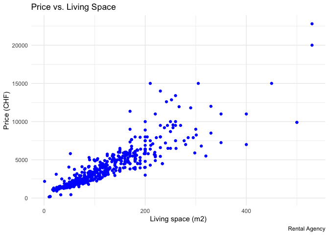
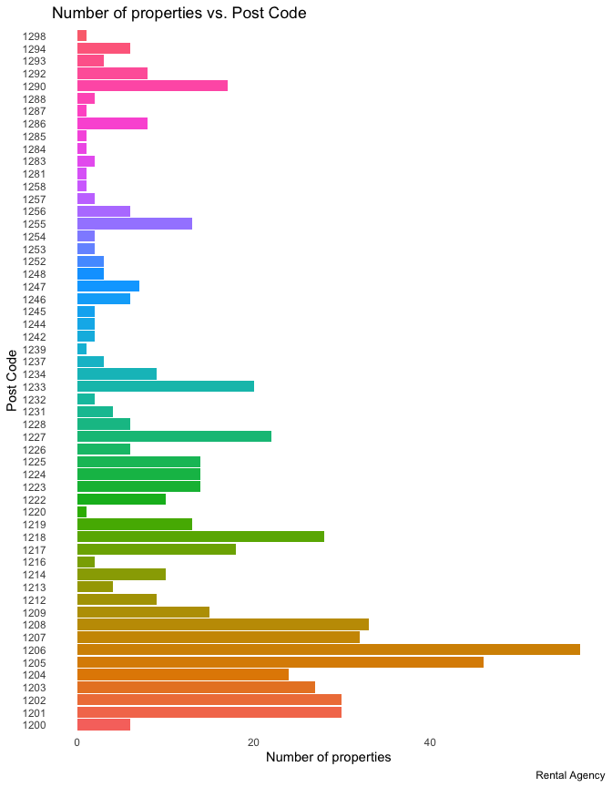
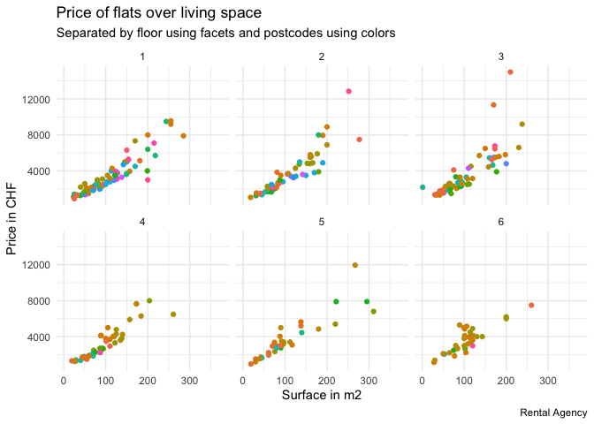
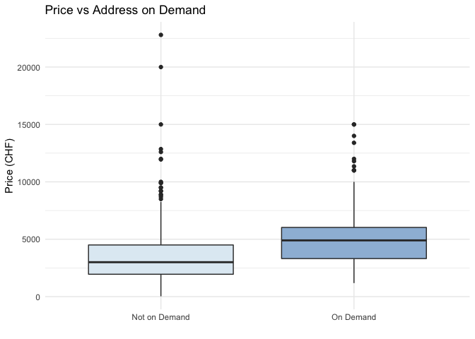
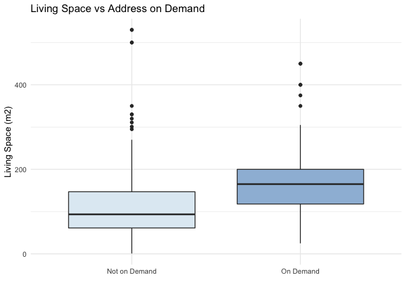
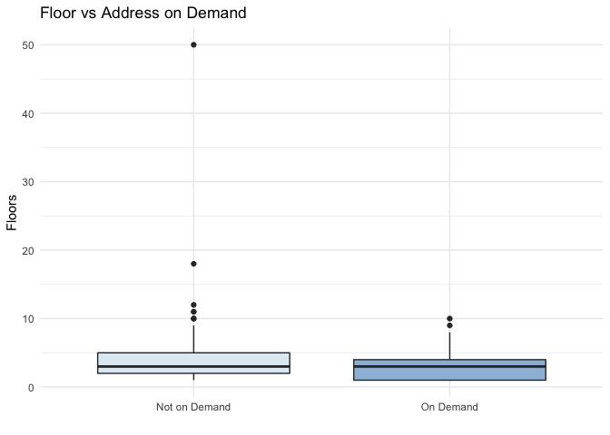
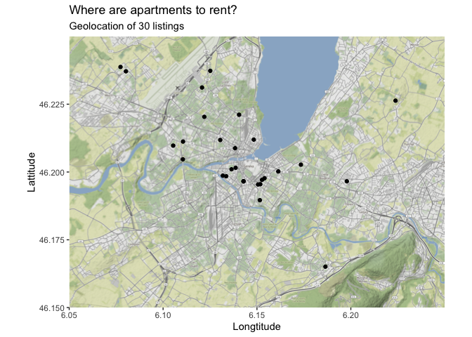

FDS Final Project: Report \#1
================

# Part 1

### Preparing the dataset for the analysis.

  - Getting the full dataset out of the Rental Agency website.
  - Creating a table of 612 rows and 9 column.
  - Converting each column to the right type.

<!-- end list -->

``` r
## Opening necessary libraries in the project

library(rvest)
library(httr)
library(stringr)
library(tibble)
library(dplyr)
library(lubridate)
library(ggplot2)
library(remedy)
library(devtools)
library(gramr)
library(knitr)
library(infer)
library(ggmap)
library(leaflet)
library(httr)
library(purrr)
library(magrittr)

## Scrapping data from the website

scraped_rental <- xml2::read_html("https://epfl-exts.github.io/rental-scrape/")

## Preparing data for all 9 categories in tibbles

living_space <- as.tibble(
      scraped_rental %>%
      html_nodes(css = ".living-space strong") %>%
      html_text()) %>%
      rename(living_space = "value") %>% 
      mutate(living_space = str_remove(living_space, " m2")) %>% 
      mutate(living_space = as.numeric(living_space))

address <- as.tibble(
      scraped_rental %>%
       html_nodes(css = ".address p") %>%
       html_text()) %>%
      rename(address = "value") 

floor <- as.tibble(
      scraped_rental %>%
      html_nodes(css = ".floor strong") %>%
      html_text()) %>%
      rename(floor = "value") %>%
      mutate(floor = as.numeric(floor)) 

usable_surface <- as.tibble(
      scraped_rental %>%
      html_nodes(css = ".usable-surface strong") %>%
      html_text()) %>%
      rename(usable_surface = "value") %>% 
      mutate(usable_surface = str_remove(usable_surface, " m2")) %>% 
      mutate(usable_surface = as.numeric(usable_surface)) 

availability <- as.tibble(scraped_rental %>%
      html_nodes(css = ".availability strong") %>%
      html_text()) %>%
      rename(availability = "value") %>%
      mutate(availability = parse_date_time(availability,orders="dmy"))

rooms <- as.tibble(scraped_rental %>%
      html_nodes(css = ".rooms strong") %>%
      html_text()) %>%
      rename(rooms = "value") %>% 
      mutate(rooms = as.numeric(rooms))

price <- as.tibble(scraped_rental %>%
      html_nodes(css = ".price strong") %>%
      html_text()) %>%
      rename(price = "value") %>% 
      mutate(price = as.numeric(price))

object_type <- as.tibble(scraped_rental %>%
      html_nodes(css = ".object-type") %>%
      html_text()) %>%
      rename(object_type = "value")

currency <- as.tibble(scraped_rental %>%
      html_nodes(css = ".price .float-right ") %>%
      html_text()) %>%
      rename(currency = "value") %>%
      mutate(currency = str_sub(currency, start = -3)) %>%
      mutate(currency = str_trim(currency, side = "both"))

## Combining 9 tables into one 

apartments <- bind_cols(object_type,address,availability,floor,  
                        price,currency,rooms,living_space,usable_surface)

## Saving file as csv

readr::write_csv(apartments,"./data/project1_apartments.csv")

## Checking data type
              
glimpse(apartments) 
```

    ## Rows: 612
    ## Columns: 9
    ## $ object_type    <chr> "Apartment", "Apartment", "Apartment", "Single house",…
    ## $ address        <chr> "Rue de la Terrassière 58, 1207 Genève", "Address on r…
    ## $ availability   <dttm> 2018-10-01, 2018-08-01, 2018-08-01, NA, 2018-08-01, N…
    ## $ floor          <dbl> 4, NA, 50, 3, 1, 2, 11, 6, 5, 2, 6, 8, NA, NA, NA, 3, …
    ## $ price          <dbl> 1900, 4500, 2100, 5500, 2340, 2895, 1980, NA, 3080, 20…
    ## $ currency       <chr> "CHF", "CHF", "CHF", "CHF", "CHF", "CHF", "CHF", "NA",…
    ## $ rooms          <dbl> 3.0, 4.0, 4.0, 6.0, 4.0, 4.5, 4.0, 5.0, 4.0, 4.0, 5.0,…
    ## $ living_space   <dbl> 63, 185, NA, 170, 73, NA, 73, 150, 117, 75, 104, NA, 9…
    ## $ usable_surface <dbl> NA, NA, NA, NA, NA, NA, NA, NA, NA, NA, NA, NA, NA, NA…

##### *After this part I obtained table with all information about properties. Used data types: character, date and double.*

# Part 2

### Presenting how price evolves with the living space of the flat on the scatterplot.

  - Clearing data from empty cells.
  - Preparing scatterplot using ggplot command.

<!-- end list -->

``` r
apartments %>%
      filter(!is.na(price), !is.na(living_space)) %>%
      ggplot(aes(
            x = living_space,
            y = price)) +
      geom_point(colour = "blue") +
      labs(
            title = "Price vs. Living Space",
            caption = "Rental Agency",
            x = "Living space (m2)",
            y = "Price (CHF)") +
      theme_minimal()
```

<!-- -->

##### *Based on the obtained plot, price is increasing along with the bigger living space.*

# Part 3

### Presenting the number of properties by postcode. Checking if agencies are more “active” in certain areas.

  - Extracting post\_codes.
  - Creating a bar plot with ggplot.

<!-- end list -->

``` r
apartment_postcode <- apartments %>%
      mutate(post_code = str_extract(address, "\\d{4}"))

apartment_postcode %>%
      group_by(post_code) %>%
      summarise(count_properties = n()) %>%
      ggplot(aes(
            x = post_code,
            y = count_properties,
            fill = post_code)) +
      geom_col(stat="identity") +
      coord_flip() +
      labs(
            title = "Number of properties vs. Post Code",
            caption = "Rental Agency",
            x = "Post Code",
            y = "Number of properties") +
      theme_minimal() +
      theme(legend.position = "none",
            panel.grid.major = element_blank(),
            panel.grid.minor = element_blank()) +
      theme(legend.position="none") 
```

<!-- -->

##### *Based on the obtained graph it seems like properties in area 1201 to 1209 are more active.*

# Part 4

### Showing how price evolves with living space of the flat by postcode and by floor.

  - Clearing empty cells.
  - Creating a scatterplot.
  - Presenting different categories with colors and facets.

<!-- end list -->

``` r
apartment_postcode %>%
      filter(!is.na(floor), floor <= 6) %>%
      ggplot(aes(
            x = living_space,
            y = price,
            color = post_code)) +
      geom_point() +
      labs(
            title = "Price of flats over living space",
            subtitle = "Separated by floor using facets and postcodes using colors",
            caption = "Rental Agency",
            x = "Surface in m2",
            y = "Price in CHF") +
      facet_wrap(vars(floor)) +
      theme_minimal() +
      theme(legend.position = "none")
```

<!-- -->

##### *Based on the obtained charts along with the bigger surface prices increase. It seems like properties on the lower floors offer bigger surface and at the same time higher prices.*

``` r
## Checking the avarage prices depending on the floor

exp_floor <- apartment_postcode %>%
      filter(!is.na(floor), !is.na(price), floor <= 6) %>%
      group_by(floor) %>%
      mutate(price_floor = round(mean(price), 2)) %>%
      arrange(price_floor) %>%
      tail(1) %>%
      select(floor) %>%
      pull()

cheap_floor <- apartment_postcode %>%
      filter(!is.na(floor), !is.na(price), floor <= 6) %>%
      group_by(floor) %>%
      mutate(price_floor = round(mean(price), 2)) %>%
      arrange(price_floor) %>%
      head(1) %>%
      select(floor) %>%
      pull()

## Checking the avarage prices depending on the post code

exp_code <- apartment_postcode %>%
      filter(!is.na(post_code), !is.na(price), floor <= 6) %>%
      group_by(post_code) %>%
      mutate(price_code = round(mean(price), 2)) %>%
      arrange(price_code) %>%
      tail(1) %>%
      select(post_code) %>%
      pull()

cheap_code <- apartment_postcode %>%
      filter(!is.na(post_code), !is.na(price), floor <= 6) %>%
      group_by(post_code) %>%
      mutate(price_code = round(mean(price), 2)) %>%
      arrange(price_code) %>%
      head(1) %>%
      select(post_code) %>%
      pull()
```

##### *On average the 5 floor is the most expensive and 4 floor is the cheapest.*

##### *On average the properties in 1292 area are the most expensive and in the 1286 area the least expensive.*

# Part 5

### Presenting trends for listings with addresses only available on demand.

  - Assigning apartments to “On demand” and “Not on Demand”(with the
    given address).
  - Creating box plots to compare distributions of values.
  - Compering price, living space and floor for these 2
groups.

<!-- end list -->

``` r
## Filtering apartments to divide them to "On Demand" and "Not On Demand". 

apartment_on_demand <- apartments %>%
      mutate(on_demand = str_extract(address, "Address on request|Sur demande|sur demande")) %>%
      mutate(on_demand = if_else(condition = is.na(on_demand),
            true = "Not on Demand",
            false = "On Demand"))

## Creating box plots

apartment_on_demand %>%
      ggplot(aes(
            x = on_demand,
            y = price,
            fill = on_demand)) +
      geom_boxplot() +
      labs(
            title = "Price vs Address on Demand",
            x = "",
            y = "Price (CHF)") +
      theme_minimal() +
      theme(legend.position="none") +
      scale_fill_brewer(palette="BuPu")
```

<!-- -->

``` r
apartment_on_demand %>%
      ggplot(aes(
            x = on_demand,
            y = living_space,
            fill = on_demand)) +
      geom_boxplot() +
      labs(
            title = "Living Space vs Address on Demand",
            x = "",
            y = "Living Space (m2)") +
      theme_minimal() +
      theme(legend.position="none") +
      scale_fill_brewer(palette="BuPu")
```

<!-- -->

``` r
apartment_on_demand %>%
      ggplot(aes(
            x = on_demand,
            y = floor,
            fill = on_demand)) +
      geom_boxplot() +
      labs(
            title = "Floor vs Address on Demand",
            x = "",
            y = "Floors") +
      theme_minimal() +
      theme(legend.position="none") +
      scale_fill_brewer(palette="BuPu")
```

<!-- -->

## Which apartments:

  - Are more expensive? *Properties “On Demand” are on avarage more
    expensive.*
  - Have bigger living space? *Properties “On Demand” have on avarage
    bigger living space.*
  - Have more floors? *Both kinds of properties have on avarage same
    number of
floors.*

# Part 6

### Compering prices per square-meter of flats “On Demand” and “Not On Demand”.

  - Adding column including price per square-meter for each property.
  - Making a table summarising group size, median, average,
    standard-deviation, minimum and maximum of variable price per
    square-meter.
  - Preparing a t-test to statistically compare the average price per
    square-meter for these types of flats.

<!-- end list -->

``` r
## Creating a statistical table

t_on_demand <- apartment_on_demand %>%
      mutate(price_space = round((price / living_space), 2)) %>%
      filter(!is.na(price_space))

t_on_demand %>%
      group_by(on_demand) %>%
      summarise(
            Size = n(),
            Median = round(median(price_space), 2),
            Average = round(mean(price_space), 2),
            Standard_deviation = round(sd(price_space), 2),
            Max = max(price_space),
            Min = min(price_space)) %>%
      knitr::kable(caption = str_glue("Statistical table for compering prices per\\
                                      square-meter of flats On Demand and Not On Demand"))
```

| on\_demand    | Size | Median | Average | Standard\_deviation |     Max |  Min |
| :------------ | ---: | -----: | ------: | ------------------: | ------: | ---: |
| Not on Demand |  374 |  33.20 |   40.15 |              111.49 | 2180.00 |  8.3 |
| On Demand     |  132 |  33.06 |   33.93 |                9.28 |   71.43 | 17.5 |

Statistical table for compering prices persquare-meter of flats On
Demand and Not On
Demand

##### *From the obtained table it seems like properties “Not on Demand” are more expensive than “On Demand”. It’s also more popular to include the address in the offer than to not to.*

``` r
## T-test

t_test_demand <- t_on_demand %>%
      infer::t_test(price_space ~ on_demand,
            order = c("On Demand", "Not on Demand"))

## Presenting the t-test in the table

t_test_demand %>%
      knitr::kable(caption = "T-test compering prices of flats On Demand and Not On Demand")
```

| statistic |   t\_df |  p\_value | alternative |  lower\_ci | upper\_ci |
| --------: | ------: | --------: | :---------- | ---------: | --------: |
|  1.068114 | 387.358 | 0.2861343 | two.sided   | \-5.227271 |  17.66238 |

T-test compering prices of flats On Demand and Not On Demand

``` r
## Preparing the p value

p_value_demand <- t_test_demand %>%
      mutate(p_value = round(p_value, 2)) %>%
      pull(p_value)
```

##### *From the obtained test, we received the p value equal to 0.29. In this case we should accept the null hypothesis, because the p-value is larger than 0.05. It turned out that the price per square-meter of the space doesn’t depend on whether the apartment’s address is on demand or not.*

# Part 7

### Compering prices of flats “On Demand” and “Not On Demand”.

  - Making a table summarising group size, median, average,
    standard-deviation, minimum and maximum of variable price per
    square-meter.
  - Preparing the t-test to statistically compare the average price per
    square-meter for these types of flats.

<!-- end list -->

``` r
## Creating a statistical table

apartment_on_demand %>%
      filter(!is.na(price)) %>%
      group_by(on_demand) %>%
      summarise(
            Size = n(),
            Median = round(median(price), 2),
            Average = round(mean(price), 2),
            Standard_deviation = round(sd(price), 2),
            Max = max(price),
            Min = min(price)) %>%
      knitr::kable(caption = "Statistical table for compering prices of flats On Demand and Not On Demand")
```

| on\_demand    | Size | Median | Average | Standard\_deviation |   Max |  Min |
| :------------ | ---: | -----: | ------: | ------------------: | ----: | ---: |
| Not on Demand |  434 |   3000 | 3602.47 |             2499.16 | 22800 |   30 |
| On Demand     |  163 |   4900 | 5200.30 |             2749.58 | 15000 | 1180 |

Statistical table for compering prices of flats On Demand and Not On
Demand

``` r
## T-test

t_test_space <- apartment_on_demand %>%
      t_test(price ~ on_demand,
            order = c("On Demand", "Not on Demand"))

## Presenting the t-test in the table

t_test_space %>%
      knitr::kable(caption = "T-test for compering prices of flats On Demand and Not On Demand")
```

|  statistic |    t\_df | p\_value | alternative |  lower\_ci |  upper\_ci |
| ---------: | -------: | -------: | :---------- | ---------: | ---------: |
| \-6.481524 | 268.4574 |        0 | two.sided   | \-2083.194 | \-1112.472 |

T-test for compering prices of flats On Demand and Not On Demand

``` r
## Preparing the p-value

p_value_space <- t_test_space %>%
      mutate(p_value = round(p_value, 10)) %>%
      pull(p_value)
```

##### *From the obtained test, we received the p value equal to 410^{-10}. In this case we should reject the null hypothesis, because the p-value is smaller than 0.05. It turned out that the price of the space depends on whether the apartment’s address is on demand or not.*

# Part 8

### Creating a map with addresses of properties to rent.

  - Preparing vectors with address details for 30 properties.
  - Filtering out adresses “On Demand”.
  - Extracting Street, City and Post Code.
  - Getting longtitude and lattitude for selected addresses from
    geocode.xyz.
  - Extracting longtitude and lattitude from the received data.
  - Creating map using {ggmap} with given addresses

<!-- end list -->

``` r
## Preparing Vectors for Street, City and Post Code

vector_post_code <- apartment_on_demand %>%
      mutate(post_code = str_extract(address, "\\d{4}")) %>%
      filter(on_demand == "Not on Demand") %>%
      select(post_code) %>%
      head(30) %>%
      unlist()

vector_street <-
      apartment_on_demand %>%
      mutate(vector_street = str_sub(address, 1, str_locate(address, ",")[, 1])) %>%
      mutate(vector_street = str_replace_all(vector_street, ",", "")) %>%
      filter(on_demand == "Not on Demand") %>%
      select(vector_street) %>%
      head(30) %>%
      unlist()

vector_city <- apartment_on_demand %>%
      mutate(vector_city = str_sub(address, str_locate(address, ",")[, 1])) %>%
      mutate(vector_city = str_replace_all(vector_city, " ", "")) %>%
      mutate(vector_city = str_sub(vector_city, start = 6)) %>%
      filter(on_demand == "Not on Demand") %>%
      select(vector_city) %>%
      head(30) %>%
      unlist()

## Getting longtitude and lattitude for selected addresses

address_location <- stringr::str_glue("https://geocode.xyz/{vector_post_code}\\
                                      +{vector_street}+{vector_city}+switzerland?json=1") %>%
      map(GET) %>%
      map(content)

## Extracting longtitude and lattitude

latt_address <- as_tibble(address_location %>%
      map(pluck, "latt") %>%
      reduce(c))

longt_address <- as_tibble(address_location %>%
      map(pluck, "longt") %>%
      reduce(c))

## Creating one tibble with longtitude and lattitude

loc_address <- bind_cols(latt_address, longt_address) %>%
      mutate(
            value = as.numeric(value),
            value1 = as.numeric(value1, 2)) %>%
      rename(
            latt_address = "value",
            longt_address = "value1")

## Creating map with given addresses

city_area <- c(left = 6.05, bottom = 46.15, right = 6.25, top = 46.25)
city_map <- get_stamenmap(bbox = city_area, zoom = 14)

ggmap(city_map) +
      geom_point(
            data = loc_address,
            aes(x = longt_address, y = latt_address)) +
      labs(
            title = "Where are apartments to rent?",
            subtitle = "Geolocation of 30 listings",
            x = "Longtitude",
            y = "Lattitude")
```

<!-- -->
