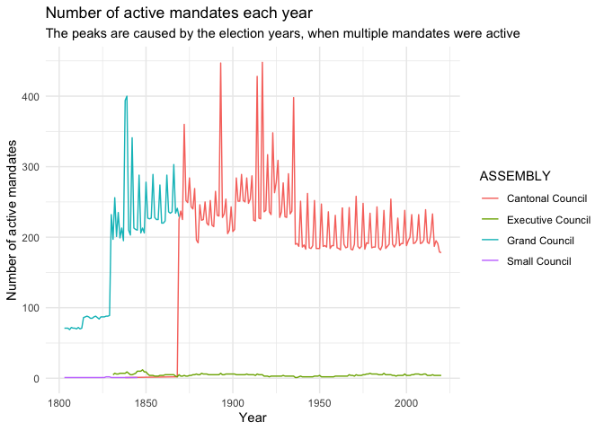
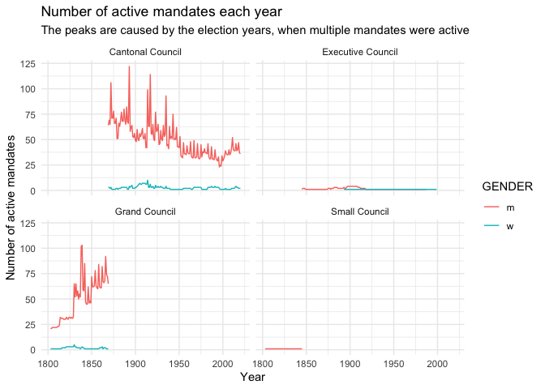
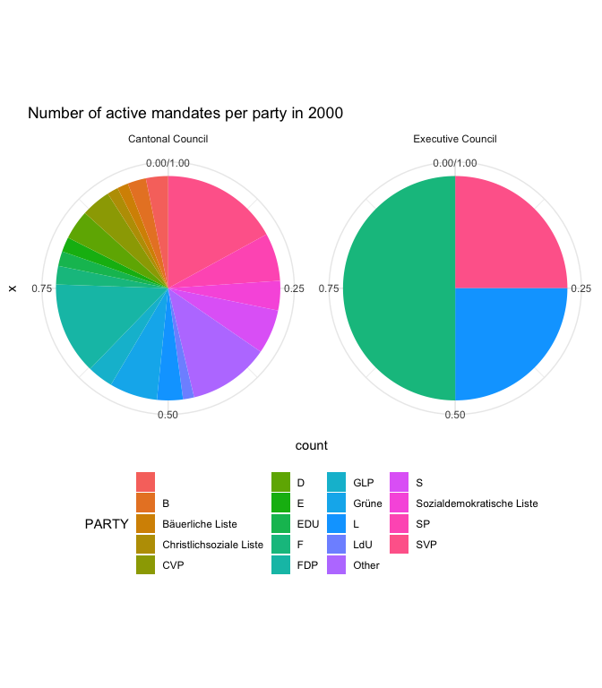
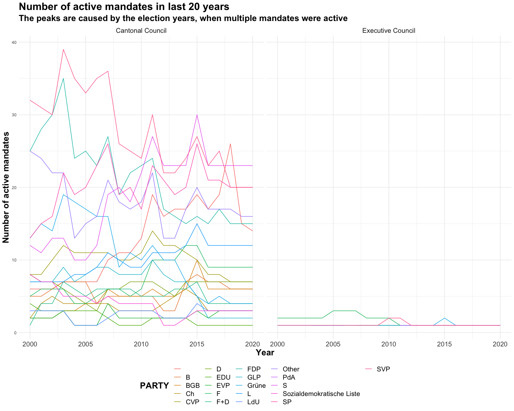
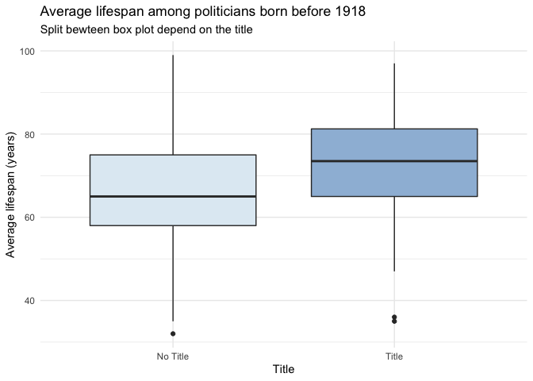
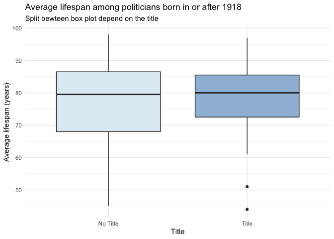
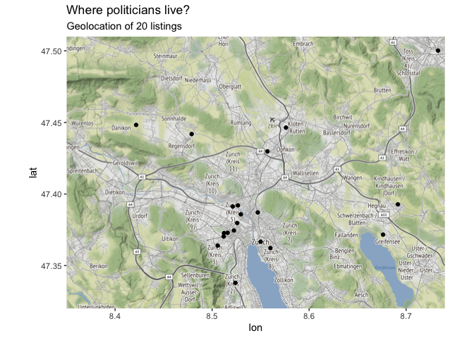

FDS Final Project: Report \#2
================

# Preparing the data from database to R

``` r
## Opening necessary libraries

library(DBI)
library(RSQLite)
library(tibble)
library(stringr)
library(knitr)
library(stringr)
library(httr)
library(magrittr)
library(purrr)
library(tidyr)
library(ggmap)
library(dplyr)
library(lubridate)
library(ggplot2)
library(shiny)
library(visdat)
library(infer)

## Downloading data from database

politicians_db <- dbConnect(RSQLite::SQLite(), "./data/zh_politicians.db")
dbListTables(politicians_db)
```

    ## [1] "ADDRESSES"    "AFFILIATIONS" "MANDATES"     "PERSONS"

``` r
## Creating tables for each database

persons <- as_tibble(dbGetQuery(
      politicians_db,
      "SELECT * FROM persons"))

addresses <- as_tibble(dbGetQuery(
      politicians_db,
      "SELECT * FROM addresses"))

mandates <- as_tibble(dbGetQuery(
      politicians_db,
      "SELECT * FROM mandates"))

affiliations <- as_tibble(dbGetQuery(
      politicians_db,
      "SELECT * FROM affiliations"))

## Disconnecting from database

dbDisconnect(politicians_db)
```

# Part 1

### Showing how the number of people with an active mandate changed over the years by assembly.

  - Extracting start and end years for active mandates.
  - Creating a table with all years for people with active mandates.
  - Creating a line plot, to show how the number of people with an
    active mandate changed over the years.

<!-- end list -->

``` r
## Creating extra rows to include all years

new_mandates <- mandates %>%
      filter(MANDATE_START_YEAR != 0) %>%
      mutate(MANDATE_END_YEAR = ifelse(MANDATE_END_YEAR == 0, year(today()),  MANDATE_END_YEAR)) %>%
      mutate(years_new = map2(MANDATE_START_YEAR, MANDATE_END_YEAR, seq)) %>%
      unnest(years_new)

## Preparing data for line plot

new_mandates <- new_mandates %>%
      mutate(years_new = as.double(years_new))

## Creating a line plot

new_mandates %>%
      group_by(years_new, ASSEMBLY) %>%
      summarise(total = n()) %>%
      ggplot(aes(
            x = years_new,
            y = total,
            colour = ASSEMBLY )) +
      geom_line() +
      labs(
            title = "Number of active mandates each year",
            subtitle = "The peaks are caused by the election years, when multiple mandates were active",
            x = "Year",
            y = "Number of active mandates") +
      theme_minimal()
```

<!-- -->

##### *From the obtained chart we can notice peaks caused by elecetion years, when multiple mandates were active at the same time. Postion of a Small Council was available only in 19th century. It seems like position of Grand Council ended around the time when Cantonal Council became more popular. Position of Executive Council and Small Council have much less mandates than the rest.*

# Part 2

### Showing how the number of people with an active mandate changed over the years by assembly and gender.

  - Joining tables to add gender.
  - Narrowing down data that we need to plot the chart.
  - Creating a line plot.
  - Adding facets for assemblies and colors for men and women.

<!-- end list -->

``` r
## Joining tables

plot_assembly <- full_join(new_mandates, persons, by = c("ID")) %>%
      select(years_new, ASSEMBLY, ID, GENDER)

## Plotting

plot_assembly %>%
      filter(!is.na(GENDER)) %>%
      group_by(years_new, GENDER, ASSEMBLY) %>%
      summarise(count = n()) %>%
      filter(!is.na(ASSEMBLY)) %>%
      ggplot(aes(
            x = years_new,
            y = count,
            colour = GENDER)) +
      geom_line() +
      labs(
            title = "Number of active mandates each year",
            subtitle = "The peaks are caused by the election years, when multiple mandates were active",
            x = "Year",
            y = "Number of active mandates") +
      facet_wrap(vars(ASSEMBLY)) +
      theme_minimal() 
```

<!-- -->

##### *Looking closer at the data we can notice that significantly more madnates belonged to male than to female. Position of Cantonal Council was available for the longest time and around 1900 year number of mandates picked up.*

# Part 3

### Presenting the proportion of elected politicians from each party in year 2000 by assembly.

  - Joining data about assemblies and affiliations.
  - Filtering data for 2000 year.
  - Calculating number of politicians per party and assembly.
  - Filtering out parties with one politician.
  - Creating bar plot with facets with one pie chart per assembly.
  - Presenting results in a table.

<!-- end list -->

``` r
## Preparing data for the chart

assembly_chart <- plot_assembly %>%
      full_join(affiliations, by = "ID") %>%
      select(years_new, ASSEMBLY, PARTY) %>%
      filter(years_new == 2000) %>%
      group_by(years_new, ASSEMBLY, PARTY) %>%
      summarise(count = n()) %>%  
      mutate(PARTY = ifelse(ASSEMBLY == "Cantonal Council" & count <= 2 , "Other", PARTY)) %>%
      group_by(years_new, ASSEMBLY, PARTY) %>%
      summarise(count = sum(count))

## Creating pie charts

assembly_chart %>%
      ggplot(aes(
            x = "",
            y = count,
            fill = PARTY)) +
      geom_bar(width = 1, stat = "identity", position = "fill") +
      facet_wrap(~ASSEMBLY) +
      coord_polar("y", start = 0) +
      labs(
            title = "Number of active mandates per party in 2000") +
      theme_minimal() +
      guides(fill = guide_legend(order = 1, ncol = 4)) +
      theme(legend.position = "bottom")
```

<!-- -->

##### *In 2000 there were only Cantonal Councils and Executive Councils.*

##### *Executive Council position was split between 3 parties while Cantonal Councils between many of them.*

##### *To obtain more clear chart for Cantonal Council position I grouped parties with one or two votes into Other group.*

``` r
## Creating table

plot_assembly %>%
      full_join(affiliations, by = "ID") %>%
      select(years_new, ASSEMBLY, PARTY) %>%
      filter(years_new == 2000) %>%
      group_by(ASSEMBLY, PARTY) %>%
      summarise(count = n()) %>%
      arrange(desc(count)) %>%
      kable(caption = "Number of active mandates per party in 2020")
```

| ASSEMBLY          | PARTY                       | count |
| :---------------- | :-------------------------- | ----: |
| Cantonal Council  | SVP                         |    32 |
| Cantonal Council  | FDP                         |    25 |
| Cantonal Council  | Grüne                       |    13 |
| Cantonal Council  | SP                          |    13 |
| Cantonal Council  | S                           |    12 |
| Cantonal Council  | CVP                         |     8 |
| Cantonal Council  | D                           |     8 |
| Cantonal Council  | Sozialdemokratische Liste   |     8 |
| Cantonal Council  | GLP                         |     7 |
| Cantonal Council  | L                           |     7 |
| Cantonal Council  |                             |     6 |
| Cantonal Council  | B                           |     5 |
| Cantonal Council  | F                           |     5 |
| Cantonal Council  | E                           |     4 |
| Cantonal Council  | EDU                         |     4 |
| Cantonal Council  | Bäuerliche Liste            |     3 |
| Cantonal Council  | Christlichsoziale Liste     |     3 |
| Cantonal Council  | LdU                         |     3 |
| Cantonal Council  | AL                          |     2 |
| Cantonal Council  | Bauernliste                 |     2 |
| Cantonal Council  | BDP                         |     2 |
| Cantonal Council  | BGB                         |     2 |
| Cantonal Council  | Ch                          |     2 |
| Cantonal Council  | EVP                         |     2 |
| Cantonal Council  | Freisinnige Liste           |     2 |
| Executive Council | F                           |     2 |
| Cantonal Council  | Bäuerlich-freisinnige Liste |     1 |
| Cantonal Council  | Demokratische Liste         |     1 |
| Cantonal Council  | Evangelische Liste          |     1 |
| Cantonal Council  | F+D                         |     1 |
| Cantonal Council  | PdA                         |     1 |
| Cantonal Council  | SVP/BGB                     |     1 |
| Cantonal Council  | U                           |     1 |
| Cantonal Council  | V+H                         |     1 |
| Executive Council | L                           |     1 |
| Executive Council | SVP                         |     1 |

Number of active mandates per party in
2020

##### *In the data there are 6 mandates without the party specified. Probably these canditates didn’t belong to any party.*

# Part 4

### Presenting how number of active mandates per each party have changed over the years.

  - Preparing data for the plot.
  - Selecting parties with low number of votes.
  - Filtering out the empty cells for mandate years.
  - Calculating number of active mandates per assembly for each year.
  - Creating a line chart to show how it changed over the years.
  - Adding facets to seperate different assemblies.

<!-- end list -->

``` r
##Selecting parties with low number of votes

parties_lowvotes <- plot_assembly %>%
      full_join(affiliations, by = "ID") %>%
      select(years_new, ASSEMBLY, PARTY) %>%
      filter(years_new >= year(today()) - 20, years_new <= year(today())) %>%
      group_by(ASSEMBLY, PARTY) %>%
      summarise(count = n()) %>%
      filter(ASSEMBLY == "Cantonal Council", count < 40) %>%
      pull(PARTY)

## Plotting the chart

plot_assembly %>%
      full_join(affiliations, by = "ID") %>%
      select(years_new, ASSEMBLY, PARTY) %>%
      filter(years_new >= year(today())-20, years_new <= year(today())) %>%
      mutate(PARTY = ifelse(ASSEMBLY == "Cantonal Council" & PARTY %in% parties_lowvotes ,  
                            "Other", PARTY)) %>%
      group_by(years_new, ASSEMBLY, PARTY) %>%
      summarise(count = n()) %>%
      ggplot(aes(
            x = years_new,
            y = count,
            colour = PARTY)) +
      geom_line() +
      labs(
            title = "Number of active mandates in last 20 years",
            subtitle = "The peaks are caused by the election years, when multiple mandates were active",
            x = "Year",
            y = "Number of active mandates") +
      facet_wrap(vars(ASSEMBLY)) +
      theme_minimal() +
      theme(
            axis.text.x = element_text( size = 14),
            axis.title.y =  element_text(size = 18, face = "bold"),
            title = element_text(size=18, face='bold'),
            legend.text = element_text( size = 14),
            strip.text = element_text( size = 14)) +
      guides(fill = guide_legend(order = 2, ncol = 5)) +
      theme(legend.position = "bottom")
```

<!-- -->

##### *To narrow down the results I selected data for last 20 years. I assigned also to Other group, parties with less than 40 total number of votes over these years.*

##### *On the above chart we can see how number of mandates changed for different positions per party over the last 20 years. Cantonal and Executive Council are the positions which are present at this time.*

# Part 5

### Checking if having a title change a life span.

  - Seperating data for politicians with and without a title.
  - Filtering out politicians that are alive.
  - Filtering out politicians under 18 years old and above 100.
  - Merging data for politicians with and without the title.
  - Creating boxplots compering life span for these 2 groups.
  - Checking the avregae lifespan for different groups.
  - Preparing t-test to see if the average life span is different for
    politicians having a TITLE compared to those without any TITLE.

<!-- end list -->

``` r
## Preparing data for the task

with_title <- persons %>%
   filter(YEAR_OF_DEATH!="", YEAR_OF_BIRTH!="", TITLE!="") %>%
   mutate(lifespan=as.numeric(YEAR_OF_DEATH) - as.numeric(YEAR_OF_BIRTH)) %>%
   filter(lifespan >=18 , lifespan<=100)  %>%
   mutate(if_title="Title")%>%
   select(lifespan,if_title)
   
without_title <- persons %>%
   filter(YEAR_OF_DEATH!="", YEAR_OF_BIRTH!="", TITLE=="") %>%
   mutate(lifespan=as.numeric(YEAR_OF_DEATH) - as.numeric(YEAR_OF_BIRTH))  %>%
   filter(lifespan >=18 , lifespan<=100)  %>%
   mutate(if_title="no Title")%>%
   select(lifespan,if_title)

## Creating table for statistical test

stat_test <- bind_rows(with_title,without_title) 

## Visualizing data

stat_test %>%
   ggplot(aes(x=if_title,
              y=lifespan,
              fill=if_title))+
   geom_boxplot()+
   labs(title = "Average lifespan among politicians",
     subtitle = "Split bewteen box plot depend on the title ",
       x="Title",
       y="Average lifespan (years)") +
      theme_minimal() +
      theme(legend.position="none") +
      scale_fill_brewer(palette="BuPu")
```

<!-- -->

##### *Presented box plots show that average life span is longer for politicians with the title.*

``` r
## Checking avarage lifespan depending on the title

average_with_title <- with_title %>%
  summarise(average=round(mean(lifespan),2)) %>%
     pull(average)

average_without_title <- without_title %>%
  summarise(average=round(mean(lifespan),2)) %>%
     pull(average)

average_total <- persons %>%
   filter(YEAR_OF_DEATH!="", YEAR_OF_BIRTH!="") %>%
   mutate(lifespan=as.numeric(YEAR_OF_DEATH) - as.numeric(YEAR_OF_BIRTH))  %>%
   filter(lifespan >=18 , lifespan<=100) %>%
   summarise(average=round(mean(lifespan),2)) %>%
   pull(average)
```

##### *From the data given, avarage lifespan of all politicians is 70.19, for politicians with title is 73.81 and without the title is 68.2.*

``` r
## T-test

stat_test_t <- stat_test %>%
      t_test(lifespan ~ if_title,
            order = c("Title", "no Title"))

## Extracting p-value

p_value_lifespan <- stat_test_t %>%
   pull(p_value)

## Preparing table with t-test results

stat_test_t %>%
      kable(caption = "T-test checking relation between title and life span")
```

|  statistic |    t\_df | p\_value | alternative |  lower\_ci |  upper\_ci |
| ---------: | -------: | -------: | :---------- | ---------: | ---------: |
| \-5.029184 | 414.7432 |    7e-07 | two.sided   | \-7.799859 | \-3.416031 |

T-test checking relation between title and life
span

##### *From the obtained t-test we received p-value equal to 7.346535410^{-7}. It means that we can reject the null hypothesis that lifespan doesn’t depend on whetever somebody has a tittle or not.*

# Part 6

### Presenting how life span depends on the time when politicians were born.

  - Spliting data on politicians who were born before and after 1918.
  - Removing data with empty cells for date of birth and death.
  - Filtering out cases when the lifespan is shorter than 18 and longer
    than 100.
  - Assigning two new variables for politicians born before and after
    1918.
  - Creating boxplots to compare obtained these variables.
  - Carrying out t-test for both groups.

<!-- end list -->

``` r
## Preparing sets of data

born_before <- persons %>%
      filter(YEAR_OF_DEATH != "", YEAR_OF_BIRTH != "") %>%
      filter(YEAR_OF_BIRTH < 1918) %>%
      mutate(lifespan = as.numeric(YEAR_OF_DEATH) - as.numeric(YEAR_OF_BIRTH)) %>%
      filter(lifespan >= 18, lifespan <= 100) %>%
      mutate(if_title = if_else(condition = TITLE == "", true = "No Title", false = "Title")) %>%
      select(lifespan, if_title)

born_after <- persons %>%
      filter(YEAR_OF_DEATH != "", YEAR_OF_BIRTH != "") %>%
      filter(YEAR_OF_BIRTH >= 1918) %>%
      mutate(lifespan = as.numeric(YEAR_OF_DEATH) - as.numeric(YEAR_OF_BIRTH)) %>%
      filter(lifespan >= 18, lifespan <= 100) %>%
      mutate(if_title = if_else(condition = TITLE == "", true = "No Title", false = "Title")) %>%
      select(lifespan, if_title)

## Graphical comparison

born_before %>%
      ggplot(aes(
            x = if_title,
            y = lifespan,
            fill = if_title)) +
      geom_boxplot() +
      labs(
            title = "Average lifespan among politicians born before 1918",
            subtitle = "Split bewteen box plot depend on the title ",
            x = "Title",
            y = "Average lifespan (years)") +
      theme_minimal() +
      theme(legend.position="none") +
      scale_fill_brewer(palette="BuPu")
```

<!-- -->

``` r
born_after %>%
      ggplot(aes(
            x = if_title,
            y = lifespan,
            fill = if_title)) +
      geom_boxplot() +
      labs(
            title = "Average lifespan among politicians born in or after 1918",
            subtitle = "Split bewteen box plot depend on the title ",
            x = "Title",
            y = "Average lifespan (years)") +
      theme_minimal() +
      theme(legend.position="none") +
      scale_fill_brewer(palette="BuPu")
```

<!-- -->

##### *From the obtained box plots we can notice that in general avarage lifespan for people born in or after 1918 is higher.*

##### *For canditates born before 1918 it seems like having a title impacted the average lifespan. However for people born in or after 1918 avarage lifespan seems to be almost the same for people with and without the title.*

``` r
## T-test for people born before 1918

test_t_before <- born_before %>%
      t_test(lifespan ~ if_title,
            order = c("Title", "No Title"))

test_t_before %>%
      kable(caption = "T-test checking relation between title and life span for people born before 1918")
```

| statistic |    t\_df | p\_value | alternative |  lower\_ci |  upper\_ci |
| --------: | -------: | -------: | :---------- | ---------: | ---------: |
| \-4.81258 | 310.4238 |  2.3e-06 | two.sided   | \-8.259396 | \-3.465602 |

T-test checking relation between title and life span for people born
before 1918

``` r
p_value_before <- test_t_before %>%
      pull(p_value)

## T-test for people born after or in 1918

test_t_after <- born_after %>%
      t_test(lifespan ~ if_title,
            order = c("Title", "No Title"))

test_t_after %>%
      kable(caption = "T-test checking relation between title and life span for people born after 1918")
```

|   statistic |    t\_df |  p\_value | alternative | lower\_ci | upper\_ci |
| ----------: | -------: | --------: | :---------- | --------: | --------: |
| \-0.2373543 | 80.98942 | 0.8129814 | two.sided   | \-5.73028 |  4.508835 |

T-test checking relation between title and life span for people born
after 1918

``` r
p_value_after <- test_t_after %>%
      pull(p_value)
```

##### *From the obtained t-test, before 1918 we received the p-value equal to 2.329792410^{-6} and after or in 1918 the p-value is 0.8129814. Based on these results, it turned out that there is relation between lifespan and having a title for people born before 1918. This could be caused by the fact that educated people had better social status and easier access to medical help back then. For people born in or after 1918 having a title doesn’t impact on the lifespan.*

# Part 7

### Presenting which politicians have had the most mandates.

  - Combining persons and affiliations data set.
  - Filtering out top 10 results with the most number of mandates.
  - Creating a horizontal bar chart.

<!-- end list -->

``` r
## Selecting politicians with the most number of mandates

most_mandates <- affiliations %>%
      group_by(PERSON_ID) %>%
      summarise(mandates_total = n()) %>%
      arrange(desc(mandates_total)) %>%
      head(10)

## Finding names for the politicians

most_mandates_names <- most_mandates %>%
      rename(ID = "PERSON_ID") %>%
      full_join(persons, by = "ID") %>%
      select(FIRSTNAME, LASTNAME, mandates_total) %>%
      filter(!is.na(mandates_total)) %>%
      mutate(full_name = str_glue("{FIRSTNAME}", " ", "{LASTNAME}"))

## Plotting a chart

most_mandates_names %>%
      ggplot(aes(
            x = full_name,
            y = mandates_total,
            fill = full_name)) +
      geom_col() +
      labs(
            title = "Politicians with the most mandates",
            x = "Politician",
            y = "Number of mandates") +
      theme_minimal() +
      coord_flip() +
      theme(legend.position = "none")
```

<!-- -->

# Part 8

### Checking if some politicians have multiple mandates at the same time.

  - Combining days, months and years into dates.
  - Filtering out empty cells for start and end date.
  - Removing polticians with only 1 mandate to narrow down the data.
  - Compering dates when politicians had multiple mandates at the same
    time.
  - Extracting list of politicians with multiple mandates at the same
    time.

<!-- end list -->

``` r
## Finding if some politicians have multiple mandates

multiple_mandates <- affiliations %>%
      mutate(start_date = dmy(str_glue("{AFFILIATION_START_DAY}, {AFFILIATION_START_MONTH},\\
                                       {AFFILIATION_START_YEAR}", sep = "-"))) %>%
      mutate(end_date = dmy(str_glue("{AFFILIATION_END_DAY},{AFFILIATION_END_MONTH},\\
                                     {AFFILIATION_END_YEAR}", sep = "-"))) %>%
      group_by(PERSON_ID) %>%
      filter(!is.na(end_date), !is.na(start_date)) %>%
      select(PERSON_ID, start_date, end_date) %>%
      mutate(multiple_ID = n()) %>%
      filter(multiple_ID != 1) %>%
      arrange(PERSON_ID, start_date) %>%
      mutate(check = lead(start_date)) %>%
      mutate(difference = as.numeric(end_date - check)) %>%
      mutate(overlap = if_else(condition = difference <= 0,
            true = "NO", false = "YES"
      )) %>%
      filter(overlap == "YES") %>%
      select(PERSON_ID)

## Finding names for the politicians

multiple_names <- multiple_mandates %>%
      rename(ID = "PERSON_ID") %>%
      left_join(persons, by = "ID") %>%
      select(FIRSTNAME, LASTNAME) %>%
      mutate(FULL_NAME = str_glue("{FIRSTNAME}", " ", "{LASTNAME}")) %>%
      select(FULL_NAME)

## Creating a table

multiple_names %>%
      kable(caption = "Politicians with multiple mandates at the same time")
```

|   ID | FULL\_NAME          |
| ---: | :------------------ |
| 2991 | Regina Bapst-Herzog |
| 3246 | Karl Kupper         |
| 4129 | Alfred Weiss        |
| 4626 | Otto Bretscher      |
| 5051 | August Kramer       |
| 5096 | Eugen Spühler       |
| 9111 | Adolf Streuli       |
| 9468 | Willy Trostel       |

Politicians with multiple mandates at the same
time

# Part 9

### Checking if some politicians have been affiliated to different parties over the years.

  - Removing polticians with only 1 mandate to narrow down the data.
  - Obtaining data only for politicians in different parties.

<!-- end list -->

``` r
party_change <- affiliations %>%
   distinct(PERSON_ID,PARTY) %>%
   group_by(PERSON_ID) %>%
   mutate(multiple_ID = n()) %>%
   filter(multiple_ID != 1) %>%
   ungroup() %>%
   distinct(PERSON_ID) %>%
   nrow() %>%
   as.numeric()
```

##### *From the obtained data it seems like 449 politicians changed the party over the years.*

# Part 10

### Presenting on the map addresses of 20 politicians.

  - Filtering out list of 20 politicians with addresses.
  - Preparing seperate vectos for house numbers, street, post code and
    city.
  - Downloading geocoordinates from the API on the geocode website.
  - Saving longtitude and lattitude as a table.
  - Combining obtainined results into one table.
  - Using ggmap to present obtained locations on the map.

<!-- end list -->

``` r
## Prepring data 

map_addresses <- addresses %>%
      filter(STREET != "", HOUSE_NUMBER != "", POSTAL_CODE != "") %>%
      head(20) %>%
      mutate(post_code = str_sub(POSTAL_CODE, 1, 4)) %>%
      select(HOUSE_NUMBER, STREET, post_code, CITY)

vector_house_number <- map_addresses %>%
      pull(HOUSE_NUMBER)
vector_street <- map_addresses %>%
      pull(STREET)
vector_post_code <- map_addresses %>%
      pull(post_code)
vector_city <- map_addresses %>%
      pull(CITY)

## Getting data from geocode website

map_location <- str_glue("https://geocode.xyz/{vector_house_number}+{vector_street}\\
                         +{vector_post_code}+{vector_city}+switzerland?json=1") %>%
      map(GET) %>%
      map(content)

## Saving longt and latt

latt <- map_location %>%
      map_df(magrittr::extract, c("latt"))
longt <- map_location %>%
      map_df(magrittr::extract, c("longt"))

## Creating one tibble with longt and latt

loc <- as.tibble(bind_cols(latt, longt)) %>%
      mutate(latt = as.numeric(latt)) %>%
      mutate(longt = as.numeric(longt, 2))

## Creating map with given addresses

city_area <- c(left = 8.35, bottom = 47.32, right = 8.74, top = 47.51)
city_map <- get_stamenmap(bbox = city_area, zoom = 12)

ggmap(city_map) +
      geom_point(
            data = loc,
            aes(x = longt, y = latt)) +
      labs(
            title = "Where politicians live?",
            subtitle = "Geolocation of 20 listings")
```

<!-- -->
