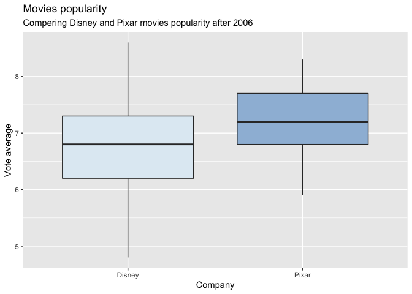

FDS Final Project: Report \#3
================

# Preparing the data

### The API used in this project is the “The Movie DB”

``` r
## Opening libraries

library(httr)
library(purrr)
library(stringr)
library(knitr)
library(janitor)
library(tibble)
library(stringr)
library(dplyr)
library(ggplot2)
library(infer)
```

# Part 1

### Gathering information to answer below questions:

  - What are the highest grossing dramas from 2010?
  - Have Will Ferrell and Liam Neeson even been in a movie together?
  - Can you find kids movies with Tom Cruise in it?

<!-- end list -->

``` r
## What are the highest grossing dramas from 2010?

gross_movie <- GET(str_glue("https://api.themoviedb.org/3/discover/movie\\
                              ?api_key=c5ef3e5bb1f1c47fe999ec03ddbef309\\
                              &with_genres=18&primary_release_year=2010\\
                              &sort_by=revenue.desc"))

top_dramas <- httr::content(gross_movie) %>%
      pluck("results") %>%
      map_df(magrittr::extract, c("title"))

top_dramas %>%
      kable(caption = "Highest grossing dramas in 2010")
```

| title                           |
| :------------------------------ |
| The Twilight Saga: Eclipse      |
| The King’s Speech               |
| The Karate Kid                  |
| Black Swan                      |
| Robin Hood                      |
| Shutter Island                  |
| Sex and the City 2              |
| True Grit                       |
| The Social Network              |
| Due Date                        |
| Eat Pray Love                   |
| Step Up 3D                      |
| The Town                        |
| The Bounty Hunter               |
| Wall Street: Money Never Sleeps |
| Dear John                       |
| Life As We Know It              |
| Hereafter                       |
| Love & Other Drugs              |
| Aftershock                      |

Highest grossing dramas in 2010

``` r
## Have Will Ferrell and Liam Neeson even been in a movie together?

together_movie <- GET(str_glue("https://api.themoviedb.org/3/discover/movie\\
                               ?api_key=c5ef3e5bb1f1c47fe999ec03ddbef309\\
                               &with_people=23659,3896"))

together_movies <- httr::content(together_movie) %>%
      pluck("results") %>%
      map_df(magrittr::extract, c("title"))

together_movies %>%
      kable(caption = "Movies that Will Ferrell and Liam Neeson were together in")
```

| title                             |
| :-------------------------------- |
| The Lego Movie                    |
| Daddy’s Home 2                    |
| Anchorman 2: The Legend Continues |
| And the Oscar Goes To…            |

Movies that Will Ferrell and Liam Neeson were together in

``` r
## Can you find kids movies with Tom Cruise in it?

kid_movie <- httr::GET(str_glue("https://api.themoviedb.org/3/discover/movie\\
                                ?api_key=c5ef3e5bb1f1c47fe999ec03ddbef309\\
                                &with_genres=10751&with_cast=500"))

kids_movies <- httr::content(kid_movie) %>%
      pluck("results") %>%
      map_df(magrittr::extract, c("title"))

kids_movies %>%
      kable(caption = "Kids movies with Tom Cruise")
```

Table: Kids movies with Tom Cruise

|| || || ||

##### *Tom cruise haven’t played in kids movies.*

# Part 2

### Finding the ID of the animation movies company “Pixar”.

  - Preparing the query to download data from API.
  - Extracting ID from received data.

<!-- end list -->

``` r
## Downloading data from API
 
pixar <- httr::GET(str_glue("https://api.themoviedb.org/3/search/company\\
                             ?api_key=c5ef3e5bb1f1c47fe999ec03ddbef309\\
                             &query=PIXAR&page=1"))

## Extracting ID

pixar_table <- httr::content(pixar) %>%
      pluck("results") %>%
      map_df(magrittr::extract, c("name", "id"))

pixar_id <- pixar_table %>%
      filter(name == "Pixar") %>%
      pull("id") %>%
      as.numeric()
```

##### *Pixar ID is 3.*

# Part 3

### Preparing a list with all Pixar movies in the order of desceding revenue.

  - Writing a query that gives all the Pixar movies and sort them by
    descending revenue.
  - Preparing a vector with all page numbers.
  - Sending a query for each page.
  - Preparing titles for all pages in one table.

<!-- end list -->

``` r
## Getting number of pages

number_pages <- httr::GET(str_glue("https://api.themoviedb.org/3/discover/movie\\
                                   ?api_key=c5ef3e5bb1f1c47fe999ec03ddbef309\\
                                   &with_companies=3&sort_by=revenue.desc")) %>%
      httr::content() %>%
      pluck("total_pages")

## To download info from API

pixar_movie <- str_glue("https://api.themoviedb.org/3/discover/movie\\
                        ?api_key=c5ef3e5bb1f1c47fe999ec03ddbef309\\
                        &with_companies={pixar_id}&sort_by=revenue.desc\\
                        &page={1:{number_pages}}") %>%
      map(httr::GET) %>%
      map(httr::content)

## To get info from each page

pixar_all <- pixar_movie %>%
      map(pluck, "results") %>%
      reduce(c) %>%
      map_df(magrittr::extract, c("original_title"))

## Displaying 10 top Pixar movies from the list in the order of descending revenue.

pixar_all %>%
      head(10) %>%
      kable(caption = "10 top Pixar movies with the highest revenue")
```

| original\_title     |
| :------------------ |
| Incredibles 2       |
| Toy Story 4         |
| Toy Story 3         |
| Finding Dory        |
| Finding Nemo        |
| Inside Out          |
| Coco                |
| Monsters University |
| Up                  |
| The Incredibles     |

10 top Pixar movies with the highest
revenue

# Part 4

### Analysing whether this was a smart strategic decision by Disney to acquire Pixar.

#### Comparing the popularity of both Disney and Pixar films that came out from 2006 onwards.

  - Acquiring the “id” for Disney using the search endpoint.
  - Specyfing “Walt Disney Pictures” in the USA.

<!-- end list -->

``` r
## Acquiring the id for Disney

disney <- httr::GET(str_glue("https://api.themoviedb.org/3/search/company\\
                             ?api_key=c5ef3e5bb1f1c47fe999ec03ddbef309\\
                             &query=Walt%20Disney%20Pictures&page=1"))

disney_id <- httr::content(disney) %>%
      pluck("results") %>%
      map_df(magrittr::extract, c("origin_country", "id")) %>%
      filter(origin_country == "US") %>%
      pull("id") %>%
      as.numeric()
```

##### *Disney ID is 2.*

#### Getting the vote averages and vote counts for films from Walt Disney Productions and from Pixar from 2006 onwards.

  - Preparing query for movies after 2006 with more then 50 votes.
  - Obtaining data both for Pixar and Disney.

<!-- end list -->

``` r
## Getting the number of pages for Disney

number_pages_disney <- httr::GET(str_glue("https://api.themoviedb.org/3/discover/movie\\
                                          ?api_key=c5ef3e5bb1f1c47fe999ec03ddbef309\\
                                          &with_companies=2&release_date.gte=2006-01-01\\
                                          &vote_count.gte=50")) %>%
      httr::content() %>%
      pluck("total_pages") %>%
      as.vector()

## Downloading data for Disney

disney_comp <- str_glue("https://api.themoviedb.org/3/discover/movie\\
                        ?api_key=c5ef3e5bb1f1c47fe999ec03ddbef309\\
                        &with_companies={disney_id}&primary_release_date.gte=2006-01-01\\
                        &vote_count.gte=50&page={1:{number_pages_disney}}") %>%
      map(httr::GET) %>%
      map(httr::content)

disney_all <- disney_comp %>%
      map(pluck, "results") %>%
      reduce(c) %>%
      map_df(magrittr::extract, c("original_title", "vote_average", "vote_count"))

## Getting the number of pages for Pixar

number_pages_pixar <- httr::GET(str_glue("https://api.themoviedb.org/3/discover/movie\\
                                              ?api_key=c5ef3e5bb1f1c47fe999ec03ddbef309\\
                                              &with_companies=3&release_date.gte=2006-01-01\\
                                              &vote_count.gte=50")) %>%
      httr::content() %>%
      pluck("total_pages") %>%
      as.vector()

## Downloading data for Pixar

pixar_comp <- str_glue("https://api.themoviedb.org/3/discover/movie\\
                       ?api_key=c5ef3e5bb1f1c47fe999ec03ddbef309\\
                       &with_companies={pixar_id}&primary_release_date.gte=2006-01-01\\
                       &vote_count.gte=50&page={1:{number_pages_pixar}}") %>%
      map(httr::GET) %>%
      map(httr::content)

pixar_all <- pixar_comp %>%
      map(pluck, "results") %>%
      reduce(c) %>%
      map_df(magrittr::extract, c("original_title", "vote_average", "vote_count"))
```

#### Comparing the vote averages using boxplots and t-test.

``` r
## Adding companies names

pixar_all <- pixar_all %>%
      mutate(company = "Pixar")

disney_all <- disney_all %>%
      mutate(company = "Disney")

## Creating one table

company_all <- bind_rows(pixar_all, disney_all)

## Presenting data using box plots

company_all %>%
      ggplot(aes(
            x = company,
            y = vote_average,
            fill = company)) +
      geom_boxplot() +
      labs(
            title = "Movies popularity",
            subtitle = "Compering Disney and Pixar movies popularity after 2006 ",
            x = "Company",
            y = "Vote average") +
      theme(legend.position = "none") +
      scale_fill_brewer(palette = "BuPu")
```

<!-- -->

##### *Based on the obtained box plots and vote avarages Pixar is more popular.*

``` r
# T-test

t_test_company <- company_all %>%
      t_test(vote_average ~ company,
            order = c("Disney", "Pixar"))

## Creating a table with results.

t_test_company %>%
      knitr::kable(caption = "Statistical table for compering Pixar and Disney avarage votes")
```

|  statistic |    t\_df |  p\_value | alternative |   lower\_ci |  upper\_ci |
| ---------: | -------: | --------: | :---------- | ----------: | ---------: |
| \-3.310579 | 103.6042 | 0.0012819 | two.sided   | \-0.6302627 | \-0.158045 |

Statistical table for compering Pixar and Disney avarage votes

``` r
## P-value

p_value_company <- t_test_company %>%
      pull(p_value)
```

##### *From obtained t-test we received the p-value equal to 0.0012819. Which means that there is a relation between avarage votes and company.*
