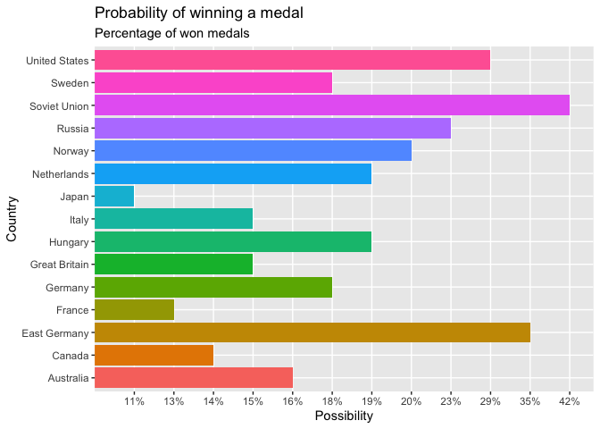
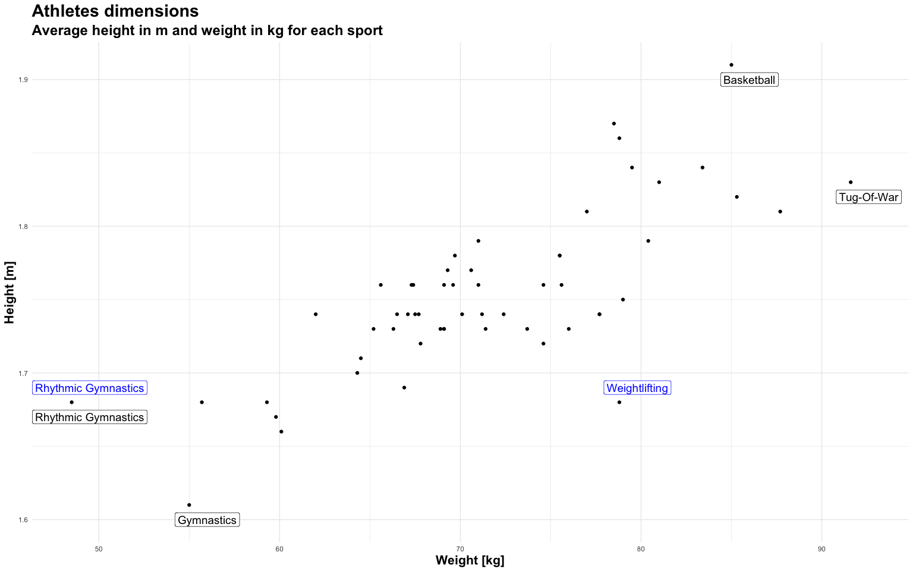

FDS Final Project: Report \#4
================

## Preparing the dataset for the analysis.

``` r
## Opening necessary libraries

library(readxl)
library(knitr)
library(dplyr)
library(stringr)
library(tidyr)
library(scales)
library(ggplot2)
library(infer)
library(knitr)
library(janitor)
library(ggrepel)

## Preparing datasets

athletes <- read_excel("./data/olympics.xlsx",
      sheet = "athletes") %>%
      clean_names()

country <- read_excel("./data/olympics.xlsx",
      sheet = "country") %>%
      clean_names()

games <- read_excel("./data/olympics.xlsx",
      sheet = "games") %>%
      clean_names()

medals <- read_excel("./data/olympics.xlsx",
      sheet = "medals") %>%
      clean_names()
```

# Part 1

### Checking if some athletes competed for different countries over the time.

  - Filtering out empty cells in noc column.
  - Filtering out athletes competing only one time, to narrow down the
    data.
  - Checking who competed over the years for different nationalities.
  - Getting the number of these athletes.

<!-- end list -->

``` r
athletes_changes <- country %>%
      filter(!is.na(noc), noc != "") %>%
      group_by(athlete_id) %>%
      mutate(multiple_noc = n()) %>%
      filter(multiple_noc != 1) %>%
      arrange(athlete_id, noc) %>%
      mutate(check = lead(noc)) %>%
      mutate(duplicate = if_else(condition = noc == check,
            true = "NO", false = "YES")) %>%
      filter(duplicate == "YES") %>%
      distinct(athlete_id) %>%
      nrow()
```

##### *1570 athletes competed for different countries over the time.*

# Part 2

### Checking who are the 10 ten athletes that took part in most games?

  - Combining info from athletes and country table.
  - Renaming id column to match athletes table.
  - Getting 10 top results for athletes that took part in most games.

<!-- end list -->

``` r
country %>%
  rename(id=athlete_id) %>%
  full_join(athletes,by="id") %>%
  select(name)%>%
  group_by(name) %>%
  summarise(count=n()) %>%
  arrange(desc(count)) %>%
  head(10) %>%
  kable(caption = "10 athletes that took part in most games")
```

| name                           | count |
| :----------------------------- | ----: |
| Ian Millar                     |    10 |
| Afanasijs Kuzmins              |     9 |
| Hubert Raudaschl               |     9 |
| Aleksandr Vladimirovich Popov  |     8 |
| Chen Jing                      |     8 |
| Durward Randolph Knowles       |     8 |
| Francisco Boza Dibos           |     8 |
| Josefa Idem-Guerrini           |     8 |
| Lesley Allison Thompson-Willie |     8 |
| Li Na                          |     8 |

10 athletes that took part in most games

# Part 3

### What athlete(s) kept a Gold medal for the longest time?

  - Preparing column with years.
  - Selecting only Gold medals.
  - Selecting necessary column.
  - Arranging data in order of events, athletes ids and games.
  - Grouping data by events and athletes ids.
  - Checking if we have more Olympics for the same group.
  - Checking if difference between years is 4. (I assumed here that
    Olympics are every 4 years).
  - Calculating cumulative sum.
  - Counting have many events are in one group.
  - Arranging the results to get 10 top athletes.
  - Getting the names from the athletes table.

<!-- end list -->

``` r
## Preparing data

gold_medals <- medals %>%
      mutate(year = as.numeric(str_sub(games, 1, 4))) %>%
      filter(medal == "Gold") %>%
      arrange(athlete_id, event, games) %>%
      group_by(athlete_id,event) %>%
      mutate(previous_year = lag(year, default = 0)) %>%
      mutate(difference = if_else(condition = as.numeric(year) - as.numeric(previous_year) != 4,
            true =  1 , false =  0 )) %>%
      ungroup() %>%
      arrange(athlete_id, event, games) %>%
      mutate(medals_groups = as.character(cumsum(difference))) %>%
      group_by(medals_groups, athlete_id, event) %>%
      summarise(medals_count = n()) %>%
      arrange(desc(medals_count), athlete_id) %>%
      ungroup() 

## Creating a table

gold_medals %>%
      rename(id = athlete_id) %>%
      full_join(athletes, by = "id") %>%
      select(name, event, medals_count) %>%
      head(10) %>%
      kable(caption = "10 athletes that kept a Gold medal for the longest time")
```

| name                            | event                                         | medals\_count |
| :------------------------------ | :-------------------------------------------- | ------------: |
| Suzanne Brigit “Sue” Bird       | Basketball Women’s Basketball                 |             4 |
| Tamika Devonne Catchings        | Basketball Women’s Basketball                 |             4 |
| Paul Bert Elvstrm               | Sailing Mixed One Person Dinghy               |             4 |
| Aladr Gerevich (-Gerei)         | Fencing Men’s Sabre, Team                     |             4 |
| Jayna Hefford                   | Ice Hockey Women’s Ice Hockey                 |             4 |
| Rudolf Krpti                    | Fencing Men’s Sabre, Team                     |             4 |
| Pl dm Kovcs                     | Fencing Men’s Sabre, Team                     |             4 |
| Lisa Deshawn Leslie (-Lockwood) | Basketball Women’s Basketball                 |             4 |
| Frederick Carlton “Carl” Lewis  | Athletics Men’s Long Jump                     |             4 |
| Ryan Steven Lochte              | Swimming Men’s 4 x 200 metres Freestyle Relay |             4 |

10 athletes that kept a Gold medal for the longest
time

##### *Column medals\_count present how many times in a row gold medals were won.*

##### *After observing data it seems like Olympics were not always held every 4 years. That’s why it requirs further analysis.*

  - Ordering Olympics in the chronological order and assigning indexes.
  - Repeating steps from first part but now including indexes not years.

<!-- end list -->

``` r
## Preparing indexes for each Olympics

index_medals <- medals %>%
      filter(medal == "Gold") %>%
      select(games) %>%
      distinct() %>%
      mutate(year = as.numeric(str_sub(games, 1, 4))) %>%
      mutate(season = str_sub(games, 6)) %>%
      arrange(season, year)

index_medals <- index_medals %>%
      mutate(index = 1:nrow(index_medals))

## Finding most medals in row

most_gold_medals <- medals %>%
      filter(medal == "Gold") %>%
      full_join(index_medals, by = "games") %>%
      select(athlete_id, games, event,index) %>%
      arrange(athlete_id, event, games) %>%
      group_by(athlete_id,event) %>%
      mutate(previous_index = lag(index, default = 0)) %>%
      mutate(difference = if_else(condition = as.numeric(index) - as.numeric(previous_index) != 1,
            true =  1 , false = 0 )) %>%
      ungroup() %>%
      arrange(athlete_id, event, games) %>%
      mutate(medals_groups = as.character(cumsum(difference))) %>%
      group_by(medals_groups, athlete_id, event) %>%
      summarise(medals_count = n()) %>%
      arrange(desc(medals_count), athlete_id) %>%
      ungroup()

## Creating a table

most_gold_medals %>%
      rename(id = athlete_id) %>%
      full_join(athletes, by = "id") %>%
      select(name, event, medals_count) %>%
      head(10) %>%
      kable(caption = "10 athletes who kept a Gold medal for the longest time")
```

| name                            | event                              | medals\_count |
| :------------------------------ | :--------------------------------- | ------------: |
| Aladr Gerevich (-Gerei)         | Fencing Men’s Sabre, Team          |             6 |
| Pl dm Kovcs                     | Fencing Men’s Sabre, Team          |             5 |
| Suzanne Brigit “Sue” Bird       | Basketball Women’s Basketball      |             4 |
| Tamika Devonne Catchings        | Basketball Women’s Basketball      |             4 |
| Paul Bert Elvstrm               | Sailing Mixed One Person Dinghy    |             4 |
| Raymond Clarence “Ray” Ewry     | Athletics Men’s Standing High Jump |             4 |
| Raymond Clarence “Ray” Ewry     | Athletics Men’s Standing Long Jump |             4 |
| Jayna Hefford                   | Ice Hockey Women’s Ice Hockey      |             4 |
| Rudolf Krpti                    | Fencing Men’s Sabre, Team          |             4 |
| Lisa Deshawn Leslie (-Lockwood) | Basketball Women’s Basketball      |             4 |

10 athletes who kept a Gold medal for the longest
time

##### *After taking into account that Olympics were not only held every 4 years, it turned out that we have more gold medals won in a row. Some athletes kept actually the gold medal for longer time. For example because of the war several Olympics were cancelled and actually there was a 12 years gap. Some athletes won just before and after the war.*

# Part 4

### What country(ies) kept a Gold medal for the longest time?

  - Ordering Olympics in the chronological order and assigning indexes.
  - Selecting only Gold medals.
  - Getting unique values to eliminate extra rows for team sports.
  - Arranging data in order of teams, events and games.
  - Grouping data by team and event.
  - Checking if we have more Olympics for the same group in row.
  - Checking if difference between indexes is 1.
  - Calculating cumulative sum.
  - Counting have many events are in one group.

<!-- end list -->

``` r
## Preparing indexes for each Olympics

index_medals <- medals %>%
      select(games) %>%
      distinct() %>%
      mutate(year = as.numeric(str_sub(games, 1, 4))) %>%
      mutate(season = str_sub(games, 6)) %>%
      arrange(season, year)

index_medals <- index_medals %>%
      mutate(index = 1:nrow(index_medals))

## Finding most medals in row

most_gold_medals <- medals %>%
      filter(medal == "Gold") %>%
      select(games,team,event) %>%
      unique() %>%
      left_join(index_medals, by = "games") %>%
      select(team, games, event, index) %>%
      arrange(team, event, games) %>%
      group_by(team, event) %>%
      mutate(previous_index = lag(index, default = 0)) %>%
      mutate(difference = if_else(condition = as.numeric(index) - as.numeric(previous_index) != 1,
            true = "1", false = "0")) %>%
      ungroup() %>%
      arrange(team, event, games) %>%
      mutate(medals_groups = as.character(cumsum(difference))) %>%
      ##filter(team=="United States")
      group_by(medals_groups,team, event) %>%
      summarise(medals_count = n()) %>%
      arrange(desc(medals_count)) %>%
      ungroup()

## Creating a table

most_gold_medals %>%
      select(team, event, medals_count) %>%
      head(10) %>%
      kable(caption = "10 countries that kept a Gold medal for the longest time")
```

| team          | event                                      | medals\_count |
| :------------ | :----------------------------------------- | ------------: |
| United States | Athletics Men’s Pole Vault                 |            13 |
| United States | Diving Men’s Springboard                   |            11 |
| Hungary       | Fencing Men’s Sabre, Individual            |             9 |
| Kenya         | Athletics Men’s 3,000 metres Steeplechase  |             9 |
| United States | Athletics Men’s 110 metres Hurdles         |             9 |
| United States | Swimming Men’s 4 x 100 metres Medley Relay |             9 |
| South Korea   | Archery Women’s Team                       |             8 |
| Soviet Union  | Gymnastics Women’s Team All-Around         |             8 |
| United States | Athletics Men’s 4 x 100 metres Relay       |             8 |
| United States | Athletics Men’s Long Jump                  |             8 |

10 countries that kept a Gold medal for the longest time

# Part 5

### Who are the 10 athletes that competed in the most events ?

  - Combining info about medals and athletes.
  - Counting number of events.
  - Selecting top athletes.

<!-- end list -->

``` r
medals %>%
  rename(id=athlete_id) %>%
  full_join(athletes,by="id") %>%
  group_by(name) %>%
  summarise(count=n()) %>%
  arrange(desc(count)) %>%
  head(10) %>%
  kable(caption = "10 athletes who competed in the most events")
```

| name                             | count |
| :------------------------------- | ----: |
| Robert Tait McKenzie             |    58 |
| Heikki Ilmari Savolainen         |    39 |
| Joseph “Josy” Stoffel            |    38 |
| Ioannis Theofilakis              |    36 |
| Takashi Ono                      |    33 |
| Alexandros Theofilakis           |    32 |
| Alfrd (Arnold-) Hajs (Guttmann-) |    32 |
| Andreas Wecker                   |    32 |
| Jean Lucien Nicolas Jacoby       |    32 |
| Alfred August “Al” Jochim        |    31 |

10 athletes who competed in the most
events

##### *I noticed that Robert Tait McKenzie competed in “Art Competitions Mixed Sculpturing, Unknown event” many times and has only 7 unique values.*

# Part 6

### Presenting the top 15 countries with the highest number of medals.

  - Selecting 15 top countries with the highest number of medals.
  - For choosen countries presenting the number of medals per year.
  - Pulling info about year from games column.
  - Creating a new table showing the number of medals.

<!-- end list -->

``` r
## Selecting 15 countries with the most medals overall

top_countries <- medals %>%
  filter(!is.na(medal))%>%
  group_by(team)%>%
  summarise(count=n()) %>%
  arrange(desc(count)) %>%
  head(15) %>%
  pull(team)

## Creating table with numbers of medals for these countries

medals_country <- medals %>%
      filter(team == {
            top_countries}) %>%
      filter(!is.na(medal)) %>%
      mutate(year = as.numeric(str_sub(games, 1, 4))) %>%
      select(team, year) %>%
      group_by(team, year) %>%
      summarise(count = n()) %>%
      arrange(year) %>%
      pivot_wider(
            names_from = "year",
            values_from = "count")

## Leaving the NA cells empty

options(knitr.kable.NA = "")

## Presenting obtained results in a table

medals_country %>%
      select(last_col(0:10)) %>%
      kable(caption = "15 countries with the most number of medals")
```

| team          | 2016 | 2014 | 2012 | 2010 | 2008 | 2006 | 2004 | 2002 | 2000 | 1998 | 1996 |
| :------------ | ---: | ---: | ---: | ---: | ---: | ---: | ---: | ---: | ---: | ---: | ---: |
| France        |    6 |    2 |    5 |      |    4 |    1 |    5 |      |    5 |      |    5 |
| Germany       |   11 |    3 |    7 |    2 |    7 |    4 |    8 |    2 |    5 |      |   10 |
| United States |   18 |    2 |   20 |    4 |   17 |    4 |   15 |    2 |   15 |    2 |   14 |
| Australia     |    8 |      |    9 |      |    9 |      |    7 |      |   12 |    1 |    7 |
| Great Britain |    9 |      |   10 |      |    9 |      |    3 |      |    4 |      |    4 |
| Hungary       |    1 |      |    3 |      |    1 |      |    3 |      |    4 |      |    3 |
| Norway        |    1 |    1 |    1 |    1 |    2 |    1 |      |    3 |    5 |    3 |    3 |
| Sweden        |      |    3 |    1 |    4 |      |    1 |    1 |    1 |    3 |      |    4 |
| Canada        |    3 |    5 |    5 |    4 |    3 |    4 |    1 |    2 |    2 |    4 |    5 |
| Italy         |    3 |    3 |    6 |      |    3 |    1 |    8 |      |    3 |    1 |    7 |
| Netherlands   |    4 |    5 |    4 |      |    3 |      |    6 |    1 |    6 |    2 |    4 |
| Russia        |   11 |    3 |    9 |      |    8 |      |   12 |    2 |   14 |    3 |   11 |
| Japan         |    5 |      |    6 |      |    5 |      |    4 |      |    2 |      |    1 |
| Soviet Union  |      |      |      |      |      |      |      |      |      |      |      |
| East Germany  |      |      |      |      |      |      |      |      |      |      |      |

15 countries with the most number of
medals

##### *As scroll box is not possible in the gfm output, I presented only data from last 10 Olympics.*

##### *We can obsrve there that Soviet Union and East Germany didn’t win any medals as they didn’t exist anymore.*

# Part 7

### Is there a relationship between country and the probability of winning a medal?

  - Selecting the top 15 countries that I established in part 6.
  - Calculating for each country how many medals they won and how many
    lost.
  - Creating one table including percentage of won medals.
  - Plotting a bar plot.

<!-- end list -->

``` r
## Creating data for analysis

yes_medals <- medals %>%
  filter(team=={top_countries}) %>%
  select(team, medal) %>%
  filter(!is.na(medal))%>%
  group_by(team) %>%
  summarise(yes_medals=n())

no_medals <- medals %>%
  filter(team=={top_countries}) %>%
  select(team, medal) %>%
  filter(is.na(medal))%>%
  group_by(team) %>%
  summarise(no_medals=n())

total_medals <- full_join(yes_medals,no_medals,by = "team") %>%
        mutate(percentage_medal = percent(yes_medals / (yes_medals + no_medals),accuracy = 1))

## Creating a bar plot

total_medals %>%
      ggplot(aes(
            x = team,
            y = percentage_medal,
            fill = team)) +
      geom_col() +
  labs(title = "Probability of winning a medal",
     subtitle = "Percentage of won medals ",
       x="Country",
       y="Possibility") +
      theme(legend.position="none") +
  coord_flip() 
```

<!-- -->

##### *The highest possibility of winning a medal was for East Germany and Soviet Union. It seems that the pressure to win medals was high. Athletes were higly motivated to win the games, which was also connected with the situation in these countries.*

### The null-hypothesis for Chi Square test:

#### *“There is no relationship between country and whether they win a medal or not”.*

``` r
## Preparing data for chi-square test

medals_chi <- medals %>%
      filter(team == {
            top_countries}) %>%
      select(team, medal) %>%
      mutate(check = if_else(condition = is.na(medal), true = "FALSE", false = "TRUE"))

## Chi-square test

chisq_medals <- chisq_test(medals_chi, team ~ check)

## Creating table with results

chisq_medals %>%
      kable(caption = "Chi Square checking the null-hypothesis")
```

| statistic | chisq\_df | p\_value |
| --------: | --------: | -------: |
|  303.1009 |        14 |        0 |

Chi Square checking the null-hypothesis

``` r
## Assigning p_value

p_value_medals <- chisq_medals %>%
      pull(p_value)
```

##### *Since the P-value is 2.66624410^{-56} less than the significance level (0.05), we can reject the null hypothesis. Thus, we conclude that there is a relationship between country and percentage of won medals. Based on the obtained bar chart we could expect similar results because averages are higher for some countries.*

# Part 8

### Creating a scatterplot showing the average height and weight of competitors per sport.

  - Preparing data for chart.
  - Removing empty cells.
  - Combining data to get sport names.
  - Creating a scatterplot.
  - Adding labels.

<!-- end list -->

``` r
## Preparing data for chart

athletes_check <- athletes %>%
  filter(!is.na(weight), !is.na(height)) %>%
  rename(athlete_id= "id") %>%
  left_join(medals, by="athlete_id") %>%
  select(athlete_id,name, height,weight,sport) %>%
  unique() %>%
  mutate(height = round(height/100 , 2),
         BMI =  round(weight/(height ^2) , 3)) %>%
  group_by(sport) %>%
  summarize(average_height= round(mean(height),2),
            average_weight= round(mean(weight),1),
            average_BMI= round(mean(BMI),3))

## Creating a scatterplot

athletes_check %>%
      ggplot(aes(
            x = average_weight,
            y = average_height,
            label = sport)) +
      geom_point() +
      labs(
            title = "Athletes dimensions",
            subtitle = "Average height in m and weight in kg for each sport",
            x = "Weight [kg]",
            y = "Height [m]") +
      geom_label(
            data = . %>%
                  filter(
                        average_height %in% range(average_height) |
                        average_weight %in% range(average_weight)),
            nudge_x = 1, nudge_y = -0.01,
            size = 5) +
      geom_label(
            data = . %>%
                  filter(
                        average_BMI %in% range(average_BMI)),
            colour = "blue", size = 5,
            nudge_x = 1, nudge_y = 0.01) +
      theme_minimal() +
      theme(
            axis.title.y = element_text(size = 16, face = "bold"),
            axis.title.x = element_text(size = 16, face = "bold"),
            title = element_text(size = 18, face = "bold"))
```

<!-- -->

##### *On the obtained chart we can see labels for maximum and minimum height and weight. Highlithed in blue Rythmic Gymnastics has minimum BMI and Weightlifting maximum BMI.*

# Part 9

### Creating a line plot showing the number of medals given by year.

  - Filtering data for won medals.
  - Substracting years and seasons.
  - Creating a line plot.
  - Separating one line for Gold, one line for Silver and one line for
    Bronze.
  - Using facets to separate the medals at Summer games and Winter
    games.

<!-- end list -->

``` r
medals %>%
      filter(!is.na(medal)) %>%
      mutate(year = as.numeric(str_sub(games, 1, 4))) %>%
      mutate(season = str_sub(games, 6)) %>%
      group_by(year, medal, season) %>%
      summarise(count = n()) %>%
      ggplot(aes(
            x = year,
            y = count,
            color = medal)) +
      geom_line() +
      facet_wrap(~season) +
      theme_minimal()
```

<!-- -->

##### *From the obtained chart we can notice that number of medals is increasing throughout years. We can observe as well that there are many more medals for Summmer than for Winter Games, probbaly because the number of disciplines is also higher.*
